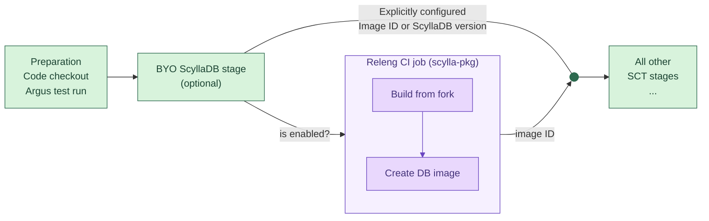

# BYO ScyllaDB (Build Your Own)

BYO ScyllaDB lets you run an SCT Jenkins job against ScyllaDB built from **your own
branch**. You don't need a pre-built AMI, image or repo. You give the job a git repo
and branch. Before the test starts, it builds ScyllaDB from them, makes a machine
image (or a deb repo for upgrades) and points the test at the result.

Use it to check an unmerged ScyllaDB change (a fix, an optimization, a debug patch)
with a longevity, performance or rolling-upgrade test before it lands.

## Which pipelines support it

The `BYO ScyllaDB Configuration` parameter section and the `BYO Scylladb [optional]`
stage exist only in these pipelines:

| Pipeline                                                              | What gets built                          | Used for                                   |
|-----------------------------------------------------------------------|------------------------------------------|--------------------------------------------|
| [`longevityPipeline`](../vars/longevityPipeline.groovy)               | Unified deb repo + DB machine image      | Image for the DB nodes                     |
| [`perfRegressionParallelPipeline`](../vars/perfRegressionParallelPipeline.groovy) | Unified deb repo + DB machine image | Image for the DB nodes                     |
| [`rollingUpgradePipeline`](../vars/rollingUpgradePipeline.groovy)     | Unified deb repo only                    | The **upgrade target** (`new_scylla_repo`) |

Other pipelines (artifacts, manager, jepsen, k8s, etc.) don't have the BYO parameters.

## How to use it

1. Push your ScyllaDB branch to a GitHub repo, usually your personal fork of
   `scylladb/scylla`.
2. Open the SCT Jenkins job and click **Build with Parameters**.
3. Fill in the **BYO ScyllaDB Configuration** section:

   | Parameter             | Required | Default                                   | Meaning |
   |-----------------------|----------|-------------------------------------------|---------|
   | `byo_scylla_repo`     | yes      | *(empty)*                                 | SSH URL of your repo, e.g. `git@github.com:<your-user>/scylla.git` |
   | `byo_scylla_branch`   | yes      | *(empty)*                                 | Branch in that repo to build |
   | `byo_job_path`        | no       | `/scylla-master/byo/byo_build_tests_dtest` | The scylla-pkg Jenkins job that runs the build (see [below](#where-the-build-runs)). A value starting with `./` is resolved relative to the folder of the current SCT job |
   | `byo_default_product` | no       | `scylla`                                  | Product name. Sets which `scylladb/<product>`, `<product>-machine-image` and `<product>-pkg` repos are used |
   | `byo_default_branch`  | no       | `next`                                    | Branch used for the "base" repos: `scylladb/scylla` (only for tags and submodule sync), `scylla-machine-image` and `scylla-pkg` |
   | `byo_build_both_arch` | no       | `false`                                   | Build both x86_64 and ARM images, not just the one the test needs. Useful if you want to reuse the same images in later runs |

4. Leave the image/repo parameters for your backend **empty**: `scylla_ami_id`,
   `gce_image_db`, `azure_image_db`, `oci_image_db` (or `new_scylla_repo` for a rolling
   upgrade). The BYO stage fills them in. If you set one of them, the job fails at once
   with `CONFLICT: "<param>" and "byo_scylla_repo"+"byo_scylla_branch" are mutually
   exclusive params.`
5. **Rolling upgrade only:** `base_versions` can stay empty (auto mode). The base
   versions are then detected right after the BYO stage, from the repo of the BYO build.
   Set it explicitly, e.g. `2025.3,2025.4`, to choose them yourself.
6. Start the build.

If `byo_scylla_repo` or `byo_scylla_branch` is empty, the stage prints
`BYO scylladb is not provided. Skipping this step.` and the job runs as usual.

### Building against a release branch

All the defaults above target the `master`/`next` line. To build on top of a release
branch, change **both** of these:

- `byo_default_branch`: the matching `next-<release>` or `branch-<release>`
- `byo_job_path`: the BYO job in the same release folder, e.g.
  `/scylla-<release>/byo/byo_build_tests_dtest`

The BYO job only accepts the stable or next branch name of its own release folder for
`DEFAULT_BRANCH`.

## What happens under the hood

The logic is in [`vars/byoScylladb.groovy`](../vars/byoScylladb.groovy). The SCT
pipeline calls it in the `BYO Scylladb [optional]` stage. The stage has a 240-minute
timeout, and it runs before any test resources are created.

1. **Checks.** The stage skips itself if repo or branch is missing. It fails if a
   conflicting image or repo parameter is set, or if the backend is `docker` or `k8s-*`.
2. **Architecture detection.** It runs `hydra get-db-arch <test_config> -b <backend>`
   ([`sct.py`](../sct.py), `get_db_arch`), which looks at the configured DB instance
   type:
   - AWS: asks the EC2 API whether the instance type is `arm64` or `x86_64`.
   - Azure: decides from the instance type naming convention.
   - GCE and OCI: always `x86_64`.

   If detection fails, it falls back to `x86_64`. With `byo_build_both_arch=true`, both
   architectures are built, but the test still uses the one detected here.
3. **Triggers the scylla-pkg BYO job** (`byo_job_path`) and waits for it to finish. It
   passes these parameters:

   | BYO job parameter                                         | Value |
   |-----------------------------------------------------------|-------|
   | `DEFAULT_BRANCH`                                          | `byo_default_branch` |
   | `SCYLLA_REPO` / `SCYLLA_BRANCH`                           | `git@github.com:scylladb/<byo_default_product>.git` / `byo_default_branch` |
   | `SCYLLA_FORK_REPO` / `SCYLLA_FORK_BRANCH`                 | `byo_scylla_repo` / `byo_scylla_branch` |
   | `MACHINE_IMAGE_REPO` / `MACHINE_IMAGE_BRANCH`             | `git@github.com:scylladb/<byo_default_product>-machine-image.git` / `byo_default_branch` |
   | `RELENG_REPO` / `RELENG_BRANCH`                           | `git@github.com:scylladb/<byo_default_product>-pkg.git` / `byo_default_branch` |
   | `BUILD_MODE`                                              | `release` |
   | `RUN_UNIT_TESTS`, `RUN_DTEST`                             | `false`. No tests run in the BYO job; SCT is the test |
   | `CREATE_UNIFIED_DEB`                                      | `true` |
   | `CREATE_CENTOS_RPM`, `CREATE_DOCKER`                      | `false` |
   | `CREATE_AMI` / `CREATE_GCE` / `CREATE_AZURE` / `CREATE_OCI` | `true` only for the current backend, and only in image-building pipelines (not rolling upgrade) |
   | `COPY_AMI_TO_REGIONS`                                     | The SCT `region` parameter. A JSON list is joined into a comma-separated string without spaces; any other value is passed as is |
   | `BUILD_X86` / `BUILD_ARM`                                 | From the architecture detection above |
   | `DEBUG_MAIL`                                              | `true`. Failure mails go only to the user who started the build |

4. **Reads the results.** The BYO job publishes its outputs as build environment
   variables. SCT reads them with `getBuildVariables()` and exports the matching `SCT_*`
   variable, so the rest of the pipeline uses the image as if you had passed it by hand:

   | Backend / case    | Variable from the BYO job (x86 / ARM)                   | Exported as            |
   |-------------------|----------------------------------------------------------|------------------------|
   | AWS               | `BYO_AMI_ID` / `BYO_AMI_ID_ARM`                          | `SCT_AMI_ID_DB_SCYLLA` |
   | GCE               | `BYO_GCE_IMAGE_DB_URL` / `BYO_GCE_IMAGE_DB_URL_ARM`      | `SCT_GCE_IMAGE_DB`     |
   | Azure             | `BYO_AZURE_IMAGE_NAME` / `BYO_AZURE_IMAGE_NAME_ARM`      | `SCT_AZURE_IMAGE_DB`   |
   | OCI               | `BYO_OCI_IMAGE_ID` / `BYO_OCI_IMAGE_ID_ARM`              | `SCT_OCI_IMAGE_DB`     |
   | Rolling upgrade   | `BYO_SCYLLA_DEB_LIST_FILE_URL`                           | `SCT_NEW_SCYLLA_REPO`  |

   For AWS, the AMI is built in `us-east-1` and copied to every region in
   `COPY_AMI_TO_REGIONS`. `BYO_AMI_ID` is a space-separated list of AMI IDs in the same
   order as those regions, which is the format SCT expects for multi-DC runs.

If the BYO job fails, SCT sets the build description to `BYO ScyllaDB failed` and
fails the job before any cluster is provisioned.
The error message links to the failed BYO build.

## Where the build runs

The build itself runs in the
[scylla-pkg](https://github.com/scylladb/scylla-pkg) repo, in
`scripts/jenkins-pipelines/byo.jenkinsfile`. Its Jenkins job is
`/scylla-master/byo/byo_build_tests_dtest`. Here is what it does, in short:

1. Checks out `SCYLLA_REPO` at the default branch and fetches its tags (so the version
   string is correct). Then it adds your repo as a `fork` remote and switches to
   `fork/<byo_scylla_branch>`. **Your branch is built exactly as it is.** It is not
   merged or rebased onto `byo_default_branch`, so rebase it yourself if you need
   recent upstream changes.
2. Builds ScyllaDB in `release` mode on an x86 node and, if requested, on an ARM node.
3. Publishes a unified deb repo. Its list file is at
   `downloads.scylladb.com/unstable/<product>/<stable-branch>/deb/unified/<build-id>/byo/scylladb-<release>/scylla.list`.
4. Builds the requested machine images from that repo with `scylla-machine-image`.

The fork is fetched with the Jenkins `github-promoter` SSH key. Your repo must be
public, or readable by that key.

To debug a failed build, open the BYO job from the SCT console log. Look for
`Scheduling project: ...` / `Starting building: ...`. Its console shows which stage
failed (build, deb repo or image creation).

## Limitations and known issues

- **Docker and Kubernetes backends are not supported.** The stage fails with
  `BYO Scylladb is not supported yet for building docker image in SCT.`
- **GCE and OCI images are x86_64 only.** The BYO job does not build ARM images for
  them, and SCT's architecture detection always picks x86_64 for these backends.
- **Only one build mode.** Builds are always `release`; debug and dev builds are not
  passed through.
- **Time.** A BYO run adds roughly the time of a full ScyllaDB release build plus image
  creation before the test starts. To run several tests on the same build, set
  `byo_build_both_arch` if needed, take the image IDs from the first run's BYO job and
  pass them directly (`scylla_ami_id`, `gce_image_db`, ...) to the next runs.
