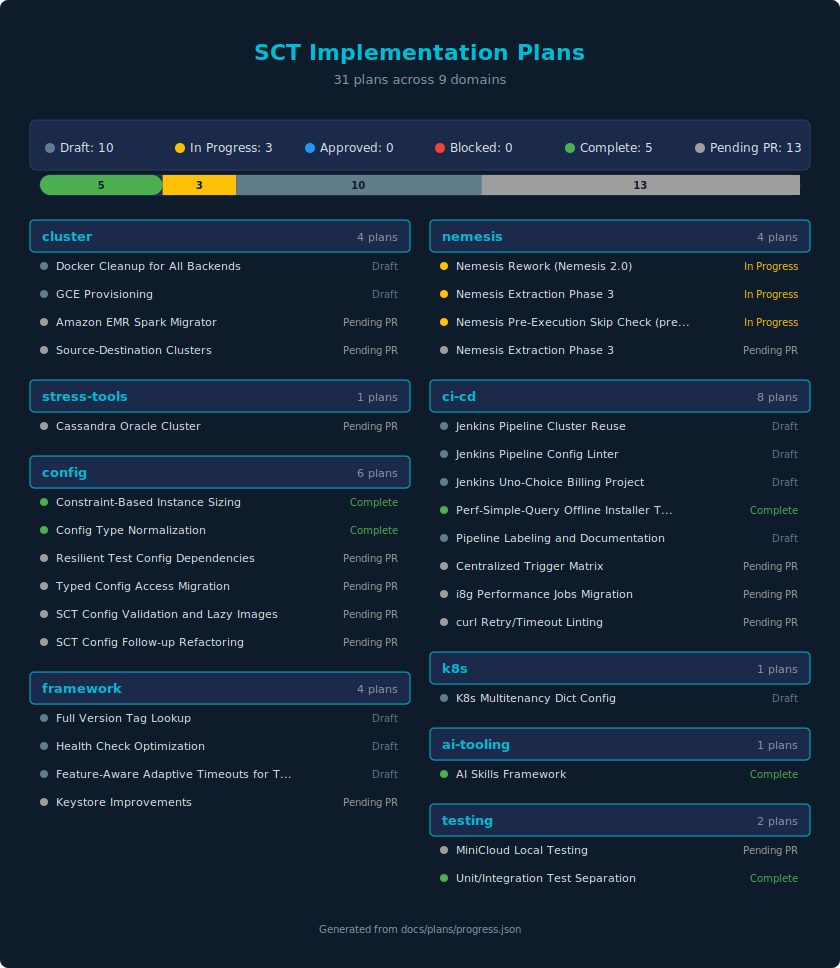

# SCT Implementation Plans — Master Index

This is the central index for all implementation plans in the SCT project.
Plans are grouped by domain and tracked with status metadata.

For plan writing guidelines, see [INSTRUCTIONS.md](INSTRUCTIONS.md).

## Status Legend

| Status | Meaning |
|--------|---------|
| `draft` | Plan written, not yet approved or started |
| `approved` | Plan reviewed and approved for implementation |
| `in_progress` | Active implementation underway |
| `blocked` | Implementation blocked by dependency or issue |
| `complete` | All phases implemented and verified |
| `pending_pr` | Plan exists in an open PR, not yet merged |

## Plans by Domain

### Cluster — Cluster management, node lifecycle, backends

| Plan | Status | File / PR |
|------|--------|-----------|
| Docker Cleanup for All Backends | `draft` | [docker-cleanup-all-backends.md](infrastructure/docker-cleanup-all-backends.md) |
| GCE Provisioning | `draft` | [gce-provisioning.md](infrastructure/gce-provisioning.md) |
| Amazon EMR Spark Migrator | `pending_pr` | [#13909](https://github.com/scylladb/scylla-cluster-tests/pull/13909) |
| Source-Destination Clusters | `pending_pr` | [#13908](https://github.com/scylladb/scylla-cluster-tests/pull/13908) |

### Nemesis — Chaos engineering, disruptors

| Plan | Status | File / PR |
|------|--------|-----------|
| Nemesis Rework (Nemesis 2.0) | `in_progress` | [nemesis-rework.md](nemesis/nemesis-rework.md) |
| Nemesis Extraction Phase 3 | `pending_pr` | [#13769](https://github.com/scylladb/scylla-cluster-tests/pull/13769) |

### Stress Tools — Load generators

| Plan | Status | File / PR |
|------|--------|-----------|
| Cassandra Oracle Cluster | `pending_pr` | [#13916](https://github.com/scylladb/scylla-cluster-tests/pull/13916) |

### CI/CD — Jenkins pipelines, Groovy libs

| Plan | Status | File / PR |
|------|--------|-----------|
| Jenkins Pipeline Config Linter | `draft` | [jenkins-pipeline-config-linter.md](jenkins/jenkins-pipeline-config-linter.md) |
| Jenkins Uno-Choice Billing Project | `draft` | [jenkins-uno-choice-billing-project.md](jenkins/jenkins-uno-choice-billing-project.md) |
| Centralized Trigger Matrix | `pending_pr` | [#13887](https://github.com/scylladb/scylla-cluster-tests/pull/13887) |
| i8g Performance Jobs Migration | `pending_pr` | [#13629](https://github.com/scylladb/scylla-cluster-tests/pull/13629) |
| curl Retry/Timeout Linting | `pending_pr` | [#13509](https://github.com/scylladb/scylla-cluster-tests/pull/13509) |

### Config — Configuration system

| Plan | Status | File / PR |
|------|--------|-----------|
| Resilient Test Config Dependencies | `pending_pr` | [#13982](https://github.com/scylladb/scylla-cluster-tests/pull/13982) |
| Typed Config Access Migration | `pending_pr` | [#13878](https://github.com/scylladb/scylla-cluster-tests/pull/13878) |
| SCT Config Validation and Lazy Images | `pending_pr` | [#13877](https://github.com/scylladb/scylla-cluster-tests/pull/13877) |
| SCT Config Follow-up Refactoring | `pending_pr` | [#13845](https://github.com/scylladb/scylla-cluster-tests/pull/13845) |

### K8s — Kubernetes operator, K8s backends

| Plan | Status | File / PR |
|------|--------|-----------|
| K8s Multitenancy Dict Config | `draft` | [k8s-multitenancy-dict-config.md](config/k8s-multitenancy-dict-config.md) |

### Framework — Core framework internals

| Plan | Status | File / PR |
|------|--------|-----------|
| Health Check Optimization | `draft` | [health-check-optimization.md](infrastructure/health-check-optimization.md) |
| Full Version Tag Lookup | `draft` | [full-version-tag-lookup.md](config/full-version-tag-lookup.md) |
| Keystore Improvements | `pending_pr` | [#14055](https://github.com/scylladb/scylla-cluster-tests/pull/14055) |

### AI Tooling — AI skills, agent guidance

| Plan | Status | File / PR |
|------|--------|-----------|
| AI Skills Framework | `draft` | [ai-skills-framework.md](ai-skills-framework.md) |
| PR Review Taxonomy Analysis | `in_progress` | [pr-review-taxonomy-analysis.md](pr-review-taxonomy-analysis.md) |

### Testing — Unit/integration test infrastructure

| Plan | Status | File / PR |
|------|--------|-----------|
| MiniCloud Local Testing | `pending_pr` | [#14009](https://github.com/scylladb/scylla-cluster-tests/pull/14009) |

## Cross-Plan Dependencies

| Dependent Plan | Depends On | Relationship |
|---------------|------------|--------------|
| Nemesis Extraction Phase 3 | Nemesis Rework | Phase 3 continues the extraction started in Nemesis 2.0 |
| SCT Config Follow-up Refactoring | SCT Config Validation and Lazy Images | Follow-up work after initial config validation |
| Typed Config Access Migration | SCT Config Follow-up Refactoring | Type safety layer on top of refactored config |

## Domain Coverage Gaps

The following domains have **no plans** currently:

| Domain | Covers | Codebase Areas |
|--------|--------|----------------|
| `monitoring` | Metrics, dashboards, reporting | `sdcm/monitorstack/`, `sdcm/reporting/` |
| `events` | Event system | `sdcm/sct_events/` |
| `remote` | Remote execution | `sdcm/remote/` |

These gaps are informational — not every domain needs an active plan.
