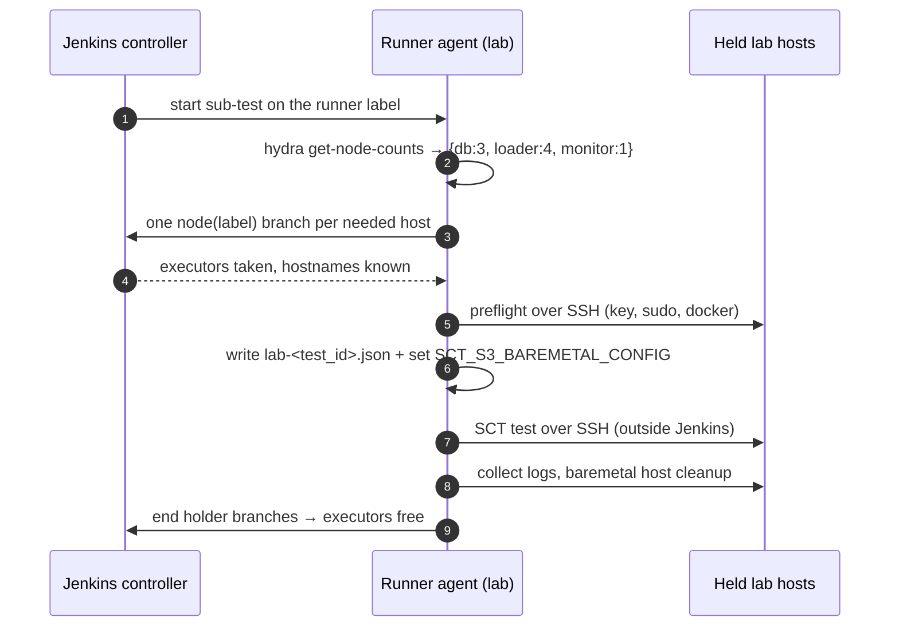
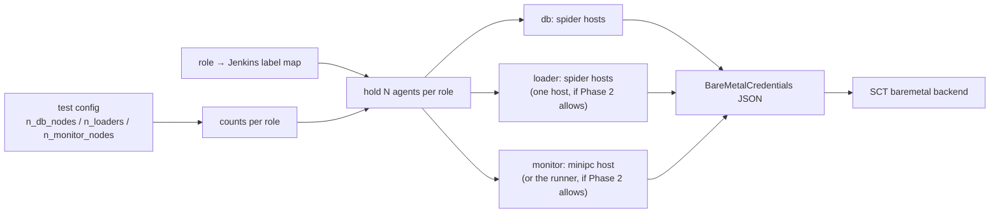
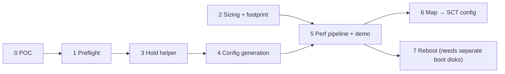

# Lab Builders as Baremetal Test Nodes, Reserved Through Jenkins

**Jira**: [SCT-900](https://scylladb.atlassian.net/browse/SCT-900) (the Jenkins setup in this plan),
part of epic [SCT-898](https://scylladb.atlassian.net/browse/SCT-898) (Running Performance tests on
Bare Metal). The perf experiments that use this setup, including the footprint investigations in
Phase 2, are tracked in [SCT-1197](https://scylladb.atlassian.net/browse/SCT-1197). The backend
groundwork it builds on was done in [SCT-901](https://scylladb.atlassian.net/browse/SCT-901).

## Problem Statement

We have lab machines (the `spider*` and `minipc*` hosts) that are already Jenkins agents. We would
like to run SCT performance tests on them as DB, loader and monitor nodes instead of renting cloud
VMs. Today nothing connects the two:

- **No reservation.** Nothing lets a test claim N lab hosts. Without a claim, a dtest or SCT
  job can land on a host while our test is using it.
- **Hand-maintained config.** The baremetal backend needs a hosts file with every host's
  address. Today someone writes that file by hand and keeps it in sync with whatever happens to
  be free.
- **The runner can't reach the lab.** The existing baremetal example pipeline still provisions
  an AWS SCT runner, and that runner can't reach hosts on the lab network.
- **SSH is checked too late.** Missing keys or sudo on a host only show up ~20 minutes into the
  run, during node init.

The idea: use Jenkins only as the **resource manager**. The pipeline reads how many nodes the test
needs. It then reserves that many agents, checks SSH access to them and writes the baremetal
hosts config. The test talks to the hosts over SSH directly, as it would to any baremetal host.
At the end the pipeline gives the agents back. Jenkins never runs test code on the reserved hosts.

## Current State

### Baremetal backend

- `sdcm/cluster_baremetal.py` (marked experimental) builds DB, loader and monitor sets from
  pre-existing hosts: `ScyllaPhysicalCluster`, `LoaderSetPhysical`, `MonitorSetPhysical`.
  `PhysicalMachineNode.reboot` is not implemented.
- `sdcm/tester.py:ClusterTester.get_cluster_baremetal` reads the hosts through
  `sdcm/keystore.py:KeyStore.get_baremetal_config`. That method **reads a local
  `<s3_baremetal_config>.json` first and falls back to S3**.
  - The file's shape is `sdcm/cluster_baremetal.py:BareMetalCredentials`. Per role, it holds an
    SSH `username` and a `node_list` of `{public_ip, private_ip}`.
  - Node counts come from the list lengths, not from `n_db_nodes`/`n_loaders`.
- The `*_ip` options in `sdcm/sct_config/mixins/baremetal.py:BaremetalConfigMixin` are only used
  when reusing a cluster. This backend never reads them.
- Hosts are cleaned after a run: `sdcm/utils/resources_cleanup.py:clean_resources_baremetal`
  together with `sdcm/cluster_baremetal.py:PhysicalHostCleanup`.
  - Cleanup frees the SSH tunnel ports and undoes Scylla's disk setup (RAID/mounts) on DB hosts.
  - It reads the **same hosts config**, so that file has to still exist when cleanup runs.
- The current example is `jenkins-pipelines/performance_staging/perf-regression-throughput-baremetal-example.jenkinsfile`
  with `test-cases/performance/perf-regression-throughput-baremetal-5gb.yaml`. It points at a
  static, hand-written `s3_baremetal_config`.

### What SCT-901 already established

SCT-901 ran the baremetal backend end to end on simulated hosts (Fedora 44 on EC2) and fixed what
broke. This plan relies on those results:

- **Host reuse needs cleanup.** A host left dirty by a previous run doesn't start Scylla at all.
  `PhysicalHostCleanup` now handles it, so the post-run cleanup stage has to run on every release.
- **Racks.** The perf test-cases need `simulated_racks` to make RF=3 keyspaces valid.
- **SCT sets up docker on loaders itself.** Monitors also get docker from SCT.
- **Fedora works**, including vector log shipping, and SELinux in enforcing mode is fine.
- **Side effect:** after its first run, a host keeps `SELINUX=disabled` in its config, because
  that is what `scylla_setup` writes.
- **The open question this plan answers.** SCT-901 left this open: "which Spider hosts are
  allocated to this effort, and are they labelled in Jenkins?" The role→label map and Phase 0
  answer it.

### Pipelines

- `vars/perfRegressionParallelPipeline.groovy`:
  - One stage resolves test duration on the builder label (via `vars/getJobTimeouts.groovy`).
  - Each sub-test then runs in its own parallel branch, optionally throttled by
    `job_throttle_category`.
  - Each branch creates an SCT runner, provisions, runs, collects logs and cleans up.
  - For `backend: baremetal`, the runner is still an AWS instance: `vars/getCloudProviderFromBackend.groovy`
    maps baremetal to aws.
- `vars/longevityPipeline.groovy` has a `local_agent` mode, used with minicloud. It skips the
  runner stages and runs hydra on the Jenkins agent itself.
- `vars/minicloudPreflight.groovy` is the existing pattern for "probe the agent, collect every
  failure, report once".
- The pipelines read the test config through hydra: `vars/getJobTimeouts.groovy` parses
  `output-conf`, and `sct.py get-db-arch` prints one resolved value.

### Configuration

- `n_db_nodes`, `n_loaders` and `n_monitor_nodes` (`sdcm/sct_config/mixins/common.py`) are
  `IntOrList`: either a plain number or per-DC values such as `"3 3"`.
- The perf demo `test-cases/performance/perf-regression-predefined-throughput-steps.yaml`
  uses 3 DB nodes and 4 loaders. With 1 monitor and the runner agent, that is **9 lab hosts per
  sub-test** as written. It sets `round_robin: true`, which spreads the stress commands across the
  loaders. Phase 2 checks whether the monitor can run on the runner agent and whether one lab host
  can do the work of all 4 loaders. If both work, a sub-test needs **5 hosts** (3 DB, 1 loader, and
  the runner doubling as monitor).
- SSH uses `user_credentials_path`, default `~/.ssh/scylla_test_id_ed25519`, which `sct.py`
  syncs from the KeyStore. Before the run, SCT only checks that the key file exists.

### The lab agents (from the live Jenkins)

| Hosts | Executors | Mode | Labels (today) |
|---|---|---|---|
| `spider*.cloudius-systems.com` | 1 | `EXCLUSIVE` | `builders_x86 dtest_local` |
| `minipc*.cloudius-systems.com` | 1 | `NORMAL` | `dtest_local dtest_ci_local minicloud-kvm-builders-*` |

- All of them connect to Jenkins themselves (inbound agents), and the node name is the hostname.
- The SCT library is loaded with `legacySCM` and runs sandboxed, so calls into Jenkins internals
  need script approval.

### Jenkins plugins that matter

| Plugin | Installed | How it helps |
|---|---|---|
| Pipeline `node` / `parallel` / `waitUntil` (core) | yes | **The reservation itself.** A `node(label)` branch that waits keeps that agent's single executor busy, so Jenkins schedules nothing else there. The branch ends on success, abort or timeout, and the agent is released with it. No script approval needed. |
| throttle-concurrents | yes | Already used by the perf pipeline, which defaults to a per-region `SCT-perf-<region>` category. Lab runs get their **own, unique category**, used only by lab mode, with a limit of 1. It keeps two lab runs from each holding half the pool and waiting forever, and lab and cloud perf runs never block each other. A Jenkins admin creates the category once in the global throttle settings. |
| scoring-load-balancer | yes | Spider nodes have scheduling preferences, which decide which host a label picks. We don't change it. |
| nodelabelparameter | yes | Optional: lets someone pin exact hosts from the job form. |
| lockable-resources | **no** | Later option: atomic "N resources with label X" (`lock(label, quantity)`), turning each node into a resource (`ENABLE_NODE_MIRROR`), and an API showing who holds what. Only worth installing if a limit of 1 lab run at a time turns out too coarse. |

## Goals

1. A perf pipeline run with lab mode on reserves exactly as many lab hosts as the test config asks
   for, per role. For the demo that is 3 DB + 4 loaders + 1 monitor, plus the runner agent.
2. While a host is reserved, Jenkins schedules no other build on it. The host goes back to the pool
   on success, failure, abort and timeout alike.
3. The baremetal hosts config is generated from the reserved hosts, with no hand-editing. It is
   kept as a build artifact and is still there when post-run cleanup reads it.
4. A host with missing keys, sudo or docker fails the run **before** the test starts, with every
   problem listed in one report.
5. The perf throughput-steps demo reaches its stress phase on lab hosts and finishes cleanly.

## End-to-end flow

This is the flow once Phase 5 is done. Each phase below builds one part of it.

How roles map to labels and hosts (a static map first, moved into SCT config in Phase 6):

## Implementation Phases

### Phase 0: Proof of concept

**Importance**: Critical

**Description**: Show, with one throwaway staging job and no library changes, that the mechanism
works on the live Jenkins: hold agents, learn their addresses without touching them, reach them
over SSH from a runner, and release them. Nothing else starts until this passes. It runs in two
steps:

1. **AWS ASG builders.** The runner and the held agents all come from an AWS builder label. That
   checks the mechanism itself without touching shared lab hosts.
   **Done (2026-10-06):** every check passed, and release worked through the Release button, an
   abort and the hold timeout
   ([results](https://github.com/scylladb/scylla-cluster-tests/pull/16346#issuecomment-6016860369)).
2. **Lab hosts.** The same job with `target=lab`, which also proves the lab network path:
   - the runner is a minipc (`minicloud-kvm-builders-rolling-upgrades`);
   - it holds one spider (`builders_x86`) and one minipc, all chosen by label.

   Lab hosts are busy on weekdays, and the minipcs run the `weekly-minicloud` cron on Friday
   nights, so this step runs on a weekend.

**Deliverables**:
- One staging jenkinsfile, run from a personal staging folder:
  [#16346](https://github.com/scylladb/scylla-cluster-tests/pull/16346). The runner and held
  labels are job parameters, so step 2 changes no code.
- It also tells us whether hydra reads the hosts file from its working directory, which settles
  Phase 4's S3 question.
- A short write-up of each step's result on this plan's PR, plus, for step 2, the chosen lab hosts.

**Definition of Done** (per step):
- [ ] **Hold**: the held agents show as busy on their Jenkins node pages while the runner branch
      runs. A job queued on the same label waits for, or gets, a different agent.
- [ ] **Info**: the runner gets the held agents' names from the holder branches and resolves
      their addresses itself:
      - EC2 API for ASG instance ids;
      - DNS for lab hostnames.

      It then archives a hosts file in the `BareMetalCredentials` shape.
- [ ] **Hosts file in hydra**: hydra syncs the SSH key and reads the hosts file back from its
      working directory.
- [ ] **Out-of-band SSH**: from the runner, SSH with `scylla_test_id_ed25519` to every held agent
      succeeds, including passwordless `sudo`.
- [ ] **Release**: normal end, abort and the build timeout each free every held executor.
- [ ] If any of these fails, this plan is revised before Phase 1 starts.

### Phase 1: Lab prerequisites and SSH preflight

**Importance**: Critical

**Description**: Write down the one-time manual setup for a lab host, and add a preflight step
that checks it on every reserved host before the test starts.

**Deliverables**:
- Documentation section: test user and key in `authorized_keys`, passwordless sudo, docker on the
  monitor host, and the list of eligible hosts.
- A preflight step in the shared library. It takes a list of hosts and roles, probes each with
  bounded SSH from the runner (login, `sudo -n`, docker for monitors, address resolution), and
  fails once with a table of every problem.

**Definition of Done**:
- [ ] Preflight passes on a correctly set-up host.
- [ ] One host without the key plus one without sudo produce a single failure that names both.

### Phase 2: Sizing command and footprint reduction

**Importance**: Critical

**Description**: Let the pipeline ask SCT how many hosts each role needs, after the test-case
and overlay files are merged. Then check two ways to need fewer hosts. The lab pool is small,
and each host saved is a host left for dtest.

**Deliverables**:
- A new `sct.py` command, modelled on `get-db-arch`, that prints the per-role totals as JSON.
  Per-DC values are added up.
- Unit tests.
- **Needs Investigation — runner as monitor.** Can the monitoring stack run on the runner agent
  itself, instead of on one more held host? Questions to answer:
  - Can the runner be listed as the monitor host, with SCT SSHing back to the agent it runs on?
  - Do the monitoring containers clash with hydra's own containers?
  - Does the runner have enough RAM and disk for Prometheus over a full perf run?
  - Does cleanup leave the runner fit for its next Jenkins build?
- **Needs Investigation — one loader host.** Can one large lab host do the work of the 4
  `c7i.8xlarge` loaders? Questions to answer:
  - Does the baremetal backend accept one host in place of 4, or the same address listed more than
    once?
  - How does `round_robin` spread the stress commands when there is only one loader?
  - Do the throughput-steps rates still hit their targets from one host, or does the loader become
    the bottleneck (loader CPU saturated before the DB is)?
- The answers go into this plan, and the lab overlay sets the counts to match.

**Definition of Done**:
- [ ] Prints `{"db": 3, "loader": 4, "monitor": 1}` for the throughput-steps config.
- [ ] `"3 3"` for `n_db_nodes` gives 6.
- [ ] Both investigations are answered in this plan, with a measured loader CPU figure for the
      single-loader case.

### Phase 3: Hold helper and static role→label map

**Importance**: Critical

**Description**: Turn the POC's hold into a reusable library step. It takes per-role counts,
reserves that many agents from each role's label, runs a body with the reserved hosts, and
releases them when the body ends for any reason.

**Deliverables**:
- A static map in the library from role (`db`, `loader`, `monitor`, `runner`) to Jenkins label
  and SSH username.
- The hold step:
  - It has a time limit for getting all the hosts, and fails cleanly instead of waiting forever.
  - It writes the reserved hosts into the build description.

**Definition of Done**:
- [ ] A staging job holding 2+1 hosts shows them busy and frees them on success, failure and abort.
- [ ] Running out of time while acquiring fails the build and frees whatever was already held.
- [ ] The new library files pass a groovy parse check (lint-pipelines does not compile `vars/`).

### Phase 4: Baremetal config generation

**Importance**: Critical

**Description**: Turn the reserved hosts into the hosts config the baremetal backend reads, and
point the run at it.

**Deliverables**:
- A library step:
  - It writes `lab-<test_id>.json` (the `BareMetalCredentials` shape) into the directory hydra
    runs from, and archives it.
  - It exports `SCT_S3_BAREMETAL_CONFIG` for the test and cleanup stages.
- Config is passed only through this local file and the env var. **No S3 upload is needed.**
  Phase 0 step 1 confirmed that hydra runs with the checkout as its working directory and that
  `KeyStore.get_baremetal_config` reads the local file
  ([staging run #2](https://jenkins.scylladb.com/job/scylla-staging/job/fruch/job/performance_staging/job/lab-nodes-hold-poc-test/2/)).

**Definition of Done**:
- [ ] `sct.py conf` with the generated file and env var passes config checks.
- [ ] Post-run cleanup finds the same file and cleans the reserved hosts.

### Phase 5: Perf pipeline lab mode and demo job

**Importance**: Critical

**Description**: Add a lab mode to `perfRegressionParallelPipeline`. With lab mode on, the
sub-test runs on the map's `runner` label and skips SCT runner creation and cloud provisioning,
the same way `local_agent` does in longevity. Each sub-test then runs in order: sizing, hold,
preflight, config, test, logs, cleanup, release. Lab mode always uses the unique lab throttle
category (limit 1). It ignores the `job_throttle_category` parameter, so a lab run can never land
in a cloud perf category by mistake.

**Deliverables**:
- Lab mode in the perf pipeline.
- A demo jenkinsfile for predefined-throughput-steps with one sub-test.
- A config overlay that switches the test-case to the baremetal backend and lab-network SSH,
  and sets `simulated_racks` to match the RF (per SCT-901).

**Definition of Done**:
- [ ] The demo reserves the hosts Phase 2 settled on (9 as written, 5 if both footprint
      reductions work), passes preflight, reaches the stress phase and finishes.
- [ ] A second lab run queued while the first is running waits on the lab throttle category;
      cloud perf runs started at the same time are not held back.
- [ ] Aborting during the stress phase still collects logs, cleans the hosts and frees all 9.
- [ ] Cloud perf jobs behave exactly as before; lint-pipelines output is unchanged for them.

### Phase 6: Move the role→label map into SCT config

**Importance**: Important

**Description**: Once Phase 5 has proven the approach, move the role-to-label map and SSH username
into baremetal config options. Then each test-case or overlay can pick its own hosts. The sizing
command reports labels together with counts.

**Deliverables**:
- New config options with documentation.
- The static library map is removed.

**Definition of Done**:
- [ ] The demo runs with the map coming from config only.

### Phase 7: Clean boot by reboot

**Importance**: Nice-to-have (blocked until the hosts have separate boot disks)

**Description**: When the lab hosts get a separate boot disk for test use, reboot each host
before handing it to the test and again on release. An agent drops its Jenkins connection when
the host reboots, so the hold changes: the host is marked **temporarily offline** (survives
reboots), and the pipeline waits for the agent to reconnect.

**Deliverables**:
- Offline-based hold with reboot on acquire and on release.
- Script approval for the Jenkins node APIs. `vars/tagBuilder.groovy` already relies on
  approved internals, so there is precedent.
- Optionally lockable-resources at this point, if one lab run at a time has become a bottleneck.

**Definition of Done**:
- [ ] A held host reboots, reconnects while still offline, and gets no other build until it is
      released.

## Testing Requirements

### Unit
- The sizing command: plain numbers, per-DC lists, a missing monitor count.
- Config generation: given hosts and roles, the JSON matches `BareMetalCredentials`, and
  `get_cluster_baremetal` can load it.

### Integration / pipeline
- Groovy parse of every new library file, plus lint-pipelines on the demo jenkinsfile.
- Staging runs on the live Jenkins for Phases 0, 3 and 5. The trigger matches the staging job
  path to the jenkinsfile path.

### Manual
- Phase 0 checklist on the live Jenkins: hold, info, SSH, release on all three end paths.
- After each staging run, check that every reserved node page shows the host idle again and that
  Scylla's disk setup was undone on the DB hosts.

## Success Criteria

1. Every Critical phase's Definition of Done is met.
2. The demo throughput-steps run finishes on lab hosts with no hand-written hosts file.
3. Over the staging runs, no other Jenkins build ran on a host while it was reserved.

## Risk Mitigation

| Risk | Likelihood | Impact | Mitigation |
|---|---|---|---|
| Scylla's disk setup on a shared dtest host takes over its data disks | Medium | High | Use only hosts whose spare disks are meant for this. Check disk layout before the first run. Host cleanup undoes the RAID; Phase 7 removes the risk entirely. |
| Two lab runs each hold part of the pool and wait for each other | Medium | Medium | Throttle category limited to 1, plus the acquisition time limit. lockable-resources if that is too coarse. |
| Pool too small: 9 hosts per sub-test, so 3 parallel sub-tests would need 27 | High | Medium | The demo uses one sub-test. Lab mode runs sub-tests one after another. The Phase 2 reductions (monitor on the runner, one loader host) bring a sub-test down to 5 hosts. |
| One loader host can't drive the target rates, which skews the results | Medium | High | Phase 2 measures loader CPU before the overlay drops to one loader. If the loader saturates first, keep more loader hosts. |
| Runner agent can't reach S3, Argus or the KeyStore from the lab network | Low | High | Phase 0 runs hydra on the runner to confirm. |
| Host is set up wrong (key, sudo, docker) | High at first | Low | Phase 1 preflight fails the run in minutes with one report. |
| The baremetal backend is experimental (no `reboot`) | Medium | Medium | Throughput-steps doesn't reboot nodes. Nemesis tests on lab hosts are out of scope. |
| A lab host's state changes for its other users: Scylla's disk setup, and `SELINUX=disabled` written on the first run | High | Medium | Tell the host owners before the first run, and record it in the lab host runbook (Phase 1). Use only hosts set aside for this. |
| An agent disconnects during the hold (for example, someone reboots the host) | Low | Medium | Holder branch fails, so the run fails visibly and the host goes back to the pool. Phase 7 handles planned reboots. |
