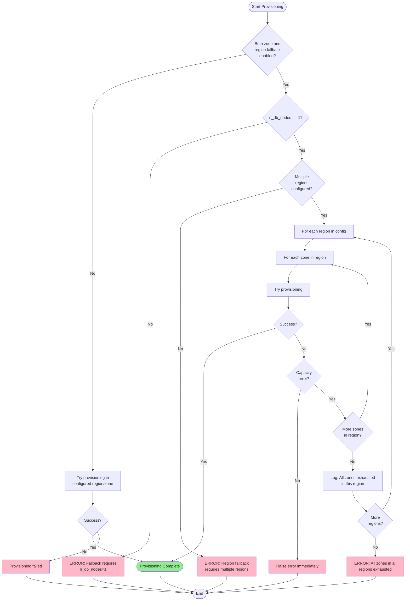

# Multi-Cloud Provisioning Resilience for Artifact Tests

## Problem Statement

Two AWS-specific provisioning features need to be extended to GCE, Azure, and OCI backends for artifact testing scenarios:

1. **instance_provision_fallback_on_demand**: Automatically fall back from spot/preemptible to on-demand instances when spot provisioning fails
2. **aws_fallback_to_next_availability_zone**: Try all availability zones sequentially to maximize chances of getting instance capacity

**Primary Use Case**: These features are designed specifically for **artifact tests** (testing new OS images, Scylla packages, database versions) where test resilience is more important than specific infrastructure topology. For artifact tests, we need *a working node somewhere* rather than a precisely configured cluster.

### Current State

**AWS (Baseline - Fully Working)**:
- Both features fully implemented
- Spot fallback via `provision_instances_with_fallback()` and legacy code
- Zone fallback via `_create_auto_zone_scylla_aws_cluster()` in tester.py

**GCE (Partially Working)**:
- Spot-to-OnDemand fallback works (uses `provision_instances_with_fallback()` from modern provisioning path)
- Zone fallback not implemented
- Has retry logic but no zone iteration

**Azure (Partially Working)**:
- Spot-to-OnDemand fallback works (uses `provision_instances_with_fallback()` from modern provisioning path)
- Zone fallback not implemented
- Has proper `OperationPreemptedError` handling

**OCI (Work In Progress)**:
- Backend infrastructure utilities exist (`sdcm/utils/oci_utils.py`, `sdcm/utils/oci_region.py`)
- Cluster implementation not yet complete
- Should be covered by this plan once backend implementation is ready
- Will follow same patterns as GCE/Azure for consistency

## Goals

**Primary Focus**: Enable provisioning resilience for artifact tests across all cloud backends

1. Make `fallback_to_next_availability_zone` backend-agnostic (remove "aws_" prefix)
2. Implement zone fallback for GCE, Azure, and OCI for single-node artifact tests
3. Add region fallback capability for all backends for single-node artifact tests
4. Ensure spot-to-ondemand fallback works consistently across all backends
5. Validate configuration to prevent misuse - both zone and region fallback only work with n_db_nodes=1
6. Maintain backward compatibility with existing AWS artifact tests
7. Provide comprehensive test coverage for artifact test scenarios
8. Design implementation to be ready for OCI backend when cluster implementation is complete

**Out of Scope**: Multi-node cluster fallback support (see Phase 8 for future considerations)

## Single-Node Limitation for Zone and Region Fallback

### Why n_db_nodes=1 is Required

Both zone fallback and region fallback features are restricted to single-node database setups (`n_db_nodes=1`). This limitation is enforced through configuration validation and serves several important purposes:

#### 1. Preventing Mixed Availability Zone Configurations

When zone fallback is enabled, the provisioning system tries different availability zones sequentially. With multi-node clusters, this could result in database nodes spread across different availability zones within the same region, which creates several problems:

- **Inconsistent Network Latency**: Nodes in different AZs experience varying network latencies, affecting replication performance and consistency
- **Unpredictable Failure Domains**: Mixed-AZ setups make it difficult to reason about failure scenarios and recovery procedures
- **Testing Complexity**: Tests would need to account for cross-AZ network behavior, making results harder to interpret

#### 2. Preventing Split-Region Clusters

When region fallback is enabled, provisioning may succeed in a different region than originally intended. With multi-node clusters, this could result in nodes split across different geographic regions, which is highly problematic:

- **High Cross-Region Latency**: Inter-region network latency (50-200ms+) severely impacts cluster performance and can cause consistency issues
- **Data Transfer Costs**: Cross-region data transfer incurs significant charges on all cloud providers, making tests unnecessarily expensive
- **Compliance and Data Residency**: Nodes in different regions may violate data locality requirements or compliance constraints
- **Unpredictable Behavior**: Split-region clusters exhibit fundamentally different performance characteristics, invalidating test results

#### 3. Cost Management

Fallback features are designed for test resilience, not production deployment patterns:

- **Regional Pricing Differences**: Instance pricing varies significantly between regions (e.g., US vs EU regions can differ by 20-30%)
- **Data Transfer Costs**: As noted above, cross-region data transfer can be expensive, especially for database workloads
- **Unexpected Cost Spikes**: Without the single-node limitation, tests could accidentally provision expensive multi-region setups

#### 4. Simplified Test Semantics

Single-node setups with fallback provide clear, predictable behavior:

- **Clear Intent**: The test just needs *a* database node somewhere, not a specific topology
- **Reproducible Results**: Performance and behavior are consistent regardless of which zone/region succeeded
- **Easier Debugging**: Logs and metrics come from a single, well-defined location

#### 5. Functional Simplicity

The fallback logic itself is simpler with single nodes:

- **No Coordination**: Don't need to ensure all nodes end up in the same zone/region
- **No Partial Failures**: Either provisioning succeeds completely in one location or fails
- **Cleaner Rollback**: If provisioning fails, no partial cluster state to clean up

### Use Cases for Fallback with n_db_nodes=1

The single-node fallback features are ideal for:

- **Artifact Testing**: Testing new OS images, Scylla packages, or database versions where you just need *a* working node
- **Basic Functional Tests**: Tests that verify features work but don't require multi-node cluster behavior
- **CI/CD Resilience**: Ensuring test pipelines don't fail due to temporary capacity constraints in specific zones/regions
- **Cost-Optimized Testing**: Trying cheaper regions first, falling back to more expensive regions only if necessary

### Multi-Node Cluster Provisioning

For multi-node clusters, the recommended approach is:

1. **Explicitly specify zone/region**: Configure the exact zone and region where you want the cluster
2. **Retry logic at test level**: If provisioning fails, the entire test can be retried with a different configuration
3. **Use spot-to-ondemand fallback**: This works with multi-node clusters and provides resilience against spot instance unavailability

### Documentation Note

This limitation and rationale will be included in the feature documentation (`docs/FALLBACK_FEATURES.md`) to ensure users understand why the constraint exists and how to use the features effectively.

## Instance Type Availability APIs by Cloud Provider

Before attempting provisioning with fallback, it's beneficial to check if instance types are available in target zones/regions. This can help filter out zones/regions where specific instance types are not supported, reducing unnecessary provisioning attempts.

### API Comparison Table

| Cloud Provider | API / Method | Scope | What It Checks | Current SCT Usage | Limitations |
|----------------|--------------|-------|----------------|-------------------|-------------|
| **AWS** | `describe-instance-type-offerings` | Zone/Region | Instance type availability in specific location | Used in `is_instance_type_supported()` | Does not check real-time capacity, only if type is offered |
| **AWS** | Reserved Capacity | Zone | Guarantees capacity availability | Not currently used | Requires pre-purchased capacity reservation |
| **AWS** | Spot Instance Advisor | Regional | Historical spot interruption rates | Not currently used | Only provides probabilistic guidance |
| **GCE** | `MachineTypesClient.get()` | Zone | Machine type exists in zone | Used in `gce_check_if_machine_type_supported()` | Does not check real-time capacity |
| **GCE** | `compute.zones.get()` | Zone | Zone availability status | Can be added | Shows if zone is UP, DOWN, or deprecated |
| **Azure** | `compute.virtual_machine_sizes.list()` | Region/Location | VM size availability in location | Used in `azure_check_instance_type_available()` | Does not check zone-level or real-time capacity |
| **Azure** | `compute.resource_skus.list()` | Region/Zone | SKU restrictions and capabilities | Can be added | Provides zone-level restrictions and quota info |
| **OCI** | `compute.list_shapes()` | Availability Domain | Shape availability in AD | Should be added when cluster ready | Returns shapes available in specific AD |
| **OCI** | `limits.get_resource_availability()` | Availability Domain | Service limits and current usage | Should be added when cluster ready | Checks against quota limits |

### Implementation Recommendations

#### For Zone Fallback Pre-Filtering

**AWS**:
- Use `ec2_client.describe_instance_type_offerings(LocationType='availability-zone')` to filter zones
- Already implemented in `sdcm/utils/aws_utils.py:is_instance_type_supported()`
- Consider adding zone status check to avoid deprecated zones

**GCE**:
- Use `MachineTypesClient.get(zone=zone, machine_type=type)` to verify type exists in zone
- Already implemented in `sdcm/utils/gce_utils.py:gce_check_if_machine_type_supported()`
- Add `compute.zones.get()` to check zone status (UP vs DOWN)

**Azure**:
- Use `compute.resource_skus.list()` with location and zone filters
- Parse `restrictions` field to identify zone-level limitations
- More precise than current `virtual_machine_sizes.list()` which only checks region-level

**OCI**:
- Use `compute_client.list_shapes(compartment_id, availability_domain)` to get shapes per AD
- Use `limits_client.get_resource_availability()` to check quota headroom
- Should be implemented when OCI cluster support is complete

#### Reserved Capacity Considerations

**AWS**: Support for On-Demand Capacity Reservations (ODCRs) could be added to guarantee capacity in specific zones. This would require:
- Configuration parameter to specify capacity reservation ID
- Modified provisioning logic to use `CapacityReservationTarget` in run_instances()
- Only practical for long-running or recurring test scenarios

**GCE**: Committed Use Discounts and Reserved Capacity work similarly but are regional, not zonal

**Azure**: Reserved VM Instances provide cost savings but don't guarantee capacity at provisioning time

**OCI**: Reserved capacity not applicable to the same extent

### Impact on Fallback Implementation

Pre-filtering zones/regions based on instance type availability can:

1. **Reduce Failed Attempts**: Skip zones where instance type isn't offered at all
2. **Faster Fallback**: Don't waste time on zones that will definitely fail
3. **Better Logging**: Distinguish between "type not available" vs "temporary capacity issue"
4. **Cost Optimization**: Try zones with lower historical spot interruption rates first (AWS)

However, important caveats:

- **Real-time Capacity**: None of these APIs check real-time capacity availability
- **Race Conditions**: Capacity can be exhausted between check and provision attempt
- **Complexity**: Pre-filtering adds code complexity and API calls
- **Quota vs Capacity**: Quota APIs show limits, not whether resources are actually available

### Recommended Approach

For the initial implementation:

1. **Use existing checks**: Leverage `is_instance_type_supported()` (AWS), `gce_check_if_machine_type_supported()` (GCE), and `azure_check_instance_type_available()` (Azure) to filter zones/regions
2. **Keep fallback logic simple**: Iterate through all zones regardless of pre-filtering, as capacity availability is dynamic
3. **Log pre-filter results**: Help with debugging by logging which zones were filtered out
4. **Future enhancement**: Consider adding zone status checks (GCE) and SKU restrictions (Azure) for more precise filtering

This approach balances implementation complexity with practical benefits while acknowledging that real-time capacity checks aren't possible through cloud provider APIs.

## Implementation Paths

There are two distinct code paths for creating database nodes that need to be aligned and tested:

1. **Legacy cluster creation path** (`sdcm/cluster_aws.py`, `sdcm/cluster_gce.py`, `sdcm/cluster_azure.py`):
   - Direct cluster class instantiation and node creation methods
   - Contains older provisioning logic
   - Used by some test cases and specific cluster creation flows

2. **Modern provisioning path** (`sdcm/provision/`, `sdcm/sct_provision/`):
   - Uses `provision_instances_with_fallback()` from `sdcm/sct_provision/instances_provider`
   - Unified provisioning interface across backends
   - Handles spot-to-ondemand fallback consistently
   - Used by newer test cases

**Alignment requirement**: Both paths must support zone and region fallback features. The implementation should:
- Add zone/region iteration logic to legacy cluster classes (cluster_aws.py, cluster_gce.py, cluster_azure.py)
- Ensure modern provisioning path properly integrates with zone/region fallback
- Test both paths to verify consistent behavior
- Consider eventual migration plan to consolidate on single provisioning approach

## Fallback Logic Flow

The following diagram illustrates how zone and region fallback work together when both are enabled:



**Key behaviors**:
- **Zone-only fallback**: Tries all zones in configured region, fails if all exhausted
- **Region-only fallback**: Tries all configured regions with default zones, fails if all exhausted
- **Both enabled**: Tries all zones in first region, then all zones in second region, etc.
- **Capacity errors**: Trigger fallback to next zone/region
- **Other errors**: Stop immediately without fallback
- **Validation**: Both features require `n_db_nodes=1` to prevent mixed AZ/region clusters

## Implementation Phases

### Phase 1: Configuration & Foundation

**Goal**: Make configuration backend-agnostic and add validation

#### Configuration Changes

**File**: `sdcm/sct_config.py`

1. Rename parameter from `aws_fallback_to_next_availability_zone` to `fallback_to_next_availability_zone`:

```python
dict(
    name="fallback_to_next_availability_zone",
    env="SCT_FALLBACK_TO_NEXT_AVAILABILITY_ZONE",
    type=boolean,
    help="""Try all availability zones one by one in order to maximize the chances of getting
           the requested instance capacity. Only works with n_db_nodes=1 to avoid mixed AZ setups.
           Works on AWS, GCE, Azure, and OCI (when available).""",
),
```

2. Add region fallback parameter:

```python
dict(
    name="fallback_to_next_region",
    env="SCT_FALLBACK_TO_NEXT_REGION",
    type=boolean,
    help="""Try all configured regions one by one when zone fallback is exhausted.
           Only works when multiple regions are configured. Requires n_db_nodes to be 1
           to avoid split clusters across regions.""",
),
```

3. Add backward compatibility for old parameter:

```python
dict(
    name="aws_fallback_to_next_availability_zone",
    env="SCT_AWS_FALLBACK_TO_NEXT_AVAILABILITY_ZONE",
    type=boolean,
    help="""DEPRECATED: Use 'fallback_to_next_availability_zone' instead.
           This parameter will be removed in a future release.""",
),
```

4. Add validation in SCTConfiguration class to prevent misuse:

```python
def _validate_fallback_configuration(self):
    """Validate fallback configuration constraints."""
    # Check db node count for zone fallback
    if self.get("fallback_to_next_availability_zone"):
        n_db_nodes = self.get("n_db_nodes")
        if isinstance(n_db_nodes, list):
            total_nodes = sum(n_db_nodes)
        else:
            total_nodes = int(n_db_nodes) if n_db_nodes else 0

        if total_nodes > 1:
            raise ValueError(
                "fallback_to_next_availability_zone only works with n_db_nodes=1. "
                f"Current configuration has {total_nodes} db nodes. "
                "Zone fallback with multiple nodes would result in mixed availability zones "
                "which is not supported."
            )

    # Check db node count and multiple regions for region fallback
    if self.get("fallback_to_next_region"):
        # Check if multiple regions configured
        regions = self.get("region_name") or []
        if isinstance(regions, str):
            regions = [r.strip() for r in regions.split(',')]

        if len(regions) <= 1:
            raise ValueError(
                "fallback_to_next_region requires multiple regions to be configured. "
                f"Current regions: {regions}"
            )

        # Check db node count
        n_db_nodes = self.get("n_db_nodes")
        if isinstance(n_db_nodes, list):
            total_nodes = sum(n_db_nodes)
        else:
            total_nodes = int(n_db_nodes) if n_db_nodes else 0

        if total_nodes > 1:
            raise ValueError(
                "fallback_to_next_region only works with n_db_nodes=1. "
                f"Current configuration has {total_nodes} db nodes. "
                "Region fallback with multiple nodes would result in split clusters "
                "across regions which is not supported."
            )
```

#### Default Configuration

**File**: `defaults/test_default.yaml`

```yaml
fallback_to_next_availability_zone: false
fallback_to_next_region: false
```

#### Test Configuration Updates

**Files**: All files in `test-cases/artifacts/`:
- ami.yaml
- ubuntu2004-fips.yaml
- ubuntu2204.yaml
- ubuntu2404.yaml
- centos9.yaml
- oel76.yaml
- oel8.yaml
- oel9.yaml
- amazon2023.yaml

Change: Replace `aws_fallback_to_next_availability_zone: true` with `fallback_to_next_availability_zone: true`

#### Code Updates

**File**: `sdcm/tester.py`

Update line 1821:
```python
# Old:
if self.params.get("aws_fallback_to_next_availability_zone"):

# New:
if self.params.get("fallback_to_next_availability_zone"):
```

#### Definition of Done

- Parameter renamed in sct_config.py
- Backward compatibility added with deprecation warning
- Validation logic added to prevent n_db_nodes > 1 with both zone and region fallback
- All test-cases/*.yaml files updated
- defaults/test_default.yaml updated
- tester.py uses new parameter name
- Unit tests pass

#### Testing

**Unit Tests** (`unit_tests/test_config.py`):

Test ideas:
- Verify new `fallback_to_next_availability_zone` parameter exists and works
- Verify deprecated `aws_fallback_to_next_availability_zone` parameter still works with deprecation mapping
- Verify region fallback validation requires multiple regions configured
- Verify region fallback validation requires n_db_nodes=1
- Verify zone fallback validation requires n_db_nodes=1
- Verify zone fallback works correctly with n_db_nodes=1

---

### Phase 2: GCE Fallback to Next Zone Implementation

**Goal**: Enable zone fallback for GCE similar to AWS

#### Zone Iteration Helper

**File**: `sdcm/tester.py`

**Function**: `_get_all_gce_zones_common_params()`
**Goal**: Get common parameters for all available GCE zones in the region by querying SUPPORTED_REGIONS and creating params for each zone

#### Auto-Zone Cluster Creation

**File**: `sdcm/tester.py`

**Function**: `_create_auto_zone_scylla_gce_cluster()`
**Goal**: Create Scylla GCE cluster with automatic zone fallback. Iterate through all zones, attempt cluster creation in each zone, catch GCE capacity errors (ZONE_RESOURCE_POOL_EXHAUSTED, QUOTA_EXCEEDED, stockout), and raise CriticalTestFailure if all zones fail.

**Cluster Creation Integration**: Update GCE cluster creation logic to use zone fallback when `fallback_to_next_availability_zone` is enabled

#### Error Detection

**File**: `sdcm/cluster_gce.py`

**Function**: `_create_node_with_retries()`
**Goal**: Enhanced retry logic to detect GCE capacity errors and distinguish them from transient errors for proper zone fallback handling

#### Definition of Done

- GCE zone iteration logic implemented
- Auto-zone cluster creation function added
- GCE cluster creation uses fallback when enabled
- GCE-specific capacity errors detected and handled
- Comprehensive logging added
- Unit tests pass

#### Testing

Test ideas:
- Mock GCE API to return capacity errors for zone-a, verify fallback to zone-b
- Verify all zones are tried before final failure
- Verify non-capacity errors raise immediately without zone fallback

**Integration Tests**:
Test zone fallback with real GCE backend using limited capacity regions

---

### Phase 3: Azure Fallback to Next Zone Implementation

**Goal**: Enable zone fallback for Azure similar to AWS/GCE

#### Zone Iteration Helper

**File**: `sdcm/tester.py`

**Function**: `_get_all_azure_zones_common_params()`
**Goal**: Get common parameters for all available Azure zones (typically zones 1, 2, 3) in the region

#### Auto-Zone Cluster Creation

**File**: `sdcm/tester.py`

**Function**: `_create_auto_zone_scylla_azure_cluster()`
**Goal**: Create Scylla Azure cluster with automatic zone fallback. Iterate through all zones, attempt cluster creation in each zone, catch Azure capacity errors (SkuNotAvailable, ZonalAllocationFailed, AllocationFailed, InsufficientCapacity, QuotaExceeded, Overconstrainted), and raise CriticalTestFailure if all zones fail.

**Cluster Creation Integration**: Update Azure cluster creation logic to use zone fallback when `fallback_to_next_availability_zone` is enabled

#### Error Detection

**File**: `sdcm/provision/azure/provisioner.py`

**Function**: `get_or_create_instances()`
**Goal**: Enhanced error detection to identify Azure capacity errors and raise ProvisionError for proper fallback handling

#### Definition of Done

- Azure zone iteration logic implemented
- Auto-zone cluster creation function added
- Azure cluster creation uses fallback when enabled
- Azure-specific capacity errors detected and handled
- Comprehensive logging added
- Unit tests pass

**Note**: OCI backend will follow the same implementation pattern as GCE and Azure once cluster implementation is complete. The design should be extensible to support OCI without significant refactoring.

#### Testing

Test ideas:
- Mock Azure API to return SKU unavailable errors for zone-1, verify fallback to zone-2
- Verify all zones are tried before final failure
- Verify non-capacity errors raise immediately without zone fallback

**Integration Tests**:
Test zone fallback with real Azure backend using limited capacity regions

---

### Phase 4: Region Fallback Implementation

**Goal**: Add ability to fall back to other configured regions when all zones in a region are exhausted

#### Region Iteration

**File**: `sdcm/tester.py`

**Function**: `_create_auto_region_scylla_aws_cluster()` (and similar for GCE, Azure, OCI)
**Goal**: Create Scylla cluster with automatic region fallback. Parse configured regions, iterate through each region trying zone fallback (if enabled) within each region, catch capacity errors, and raise CriticalTestFailure if all regions exhausted. Must integrate with existing zone fallback functionality.

#### Definition of Done

- Region iteration logic implemented for AWS, GCE, Azure, and OCI (when available)
- Region fallback integrated with zone fallback
- Validation ensures n_db_nodes=1
- Validation ensures multiple regions configured
- Unit tests pass

#### Testing

Test ideas:
- Mock cluster creation to fail in first region, succeed in second region
- Verify region iteration with zone fallback integration
- Verify validation enforces n_db_nodes=1 and multiple regions

---

### Phase 5: GCE Spot Fallback Enhancement

**Goal**: Ensure GCE spot fallback works consistently through modern provision path

#### Implementation Changes

**File**: `sdcm/cluster_gce.py`

**Function**: `_create_instances()`
**Goal**: Ensure method uses `provision_instances_with_fallback()` from modern provisioning path

**Function**: `handle_gce_preemption_error()`
**Goal**: Convert GCE-specific preemption errors to `OperationPreemptedError` for consistent fallback handling

#### Definition of Done

- GCE uses `provision_instances_with_fallback()` consistently
- GCE preemption errors properly converted to `OperationPreemptedError`
- Pricing model changes are logged
- Unit and integration tests pass

#### Testing

Test ideas:
- Mock GCE preemption error, verify fallback to on-demand pricing
- Verify fallback doesn't happen when flag is disabled
- Test integration with `provision_instances_with_fallback()`

---

### Phase 6: Azure Spot Fallback Enhancement

**Goal**: Ensure Azure spot fallback works consistently through modern provision path

Similar to Phase 5, but for Azure. Verify integration with `provision_instances_with_fallback()` and proper `OperationPreemptedError` handling.

#### Definition of Done

- Azure uses `provision_instances_with_fallback()` consistently
- `OperationPreemptedError` is properly raised and handled
- Unit and integration tests pass

---

### Phase 7: Cross-Backend Validation & Documentation

**Goal**: Ensure all backends work consistently and are well documented

#### Cross-Backend Tests

**File**: `unit_tests/test_cross_backend_fallback.py`

Test ideas:
- Parametrize tests across AWS, GCE, and Azure backends
- Verify zone fallback works consistently on all backends
- Verify spot fallback works consistently on all backends

#### Documentation

**File**: `docs/FALLBACK_FEATURES.md` (new)

Content outline:
- Spot to on-demand fallback description and configuration
- Availability zone fallback description and configuration
- Region fallback description and configuration
- Requirements and constraints (n_db_nodes=1)
- Supported backends for each feature
- Usage examples

**Supported backends:** AWS, GCE, Azure, OCI (when available)

## Region Fallback

Try all configured regions when zone fallback is exhausted.

**Configuration:**
```yaml
region_name: "us-east-1,us-west-2"
n_db_nodes: 1
fallback_to_next_availability_zone: true
fallback_to_next_region: true
```

**Requirements:**
- Only works with n_db_nodes=1
- Multiple regions must be configured
- Recommended to also enable zone fallback
- With multiple nodes, would result in split clusters across regions which is not supported

**Supported backends:** AWS, GCE, Azure, OCI (when available)
```

#### Definition of Done

- All backends use consistent parameter names and logic
- Cross-backend behavior is documented
- Integration tests pass for AWS, GCE, Azure, and OCI (when available)
- Documentation is complete

#### Testing

Integration testing:
- Run full provision test suite for each backend (AWS, GCE, Azure)
- Verify consistent behavior across all backends
- Test with various configurations and fallback scenarios

### Phase 8: Future Multi-Node Fallback Support (Not in Scope)

**Status**: Future enhancement - not part of current implementation plan

**Goal**: Explore how fallback features could support multi-node clusters while maintaining consistent zone/region placement for all resources

#### Problem with Multi-Node Fallback

The current single-node limitation exists because with multiple resources (DB nodes, loaders, monitors), we must ensure all resources land in the same zone/region to avoid:
- Split clusters across zones (inconsistent latency, different failure domains)
- Split clusters across regions (high latency 50-200ms+, expensive data transfer)
- Mixed resource placement (DB in one zone, loaders in another zone)

#### Potential Multi-Node Approach

A future implementation could support multi-node fallback using a "provision-and-filter" strategy:

**Conceptual Flow**:
1. Attempt to provision ALL resources (n_db_nodes, n_loaders, n_monitors) in target zone
2. On capacity failure, provision whatever VMs are available across multiple zones
3. Analyze provisioned VMs to identify largest zone with enough capacity
4. Filter: Keep VMs in target zone, remove VMs in other zones
5. If target zone has insufficient capacity for requirements, retry in next zone
6. Repeat until finding a zone that can fit all requirements

**Requirements for Multi-Node Support**:
- Track which zone each VM was provisioned in
- Ability to terminate partially provisioned VMs
- Logic to determine "target zone" (zone with most successful provisions or first with full capacity)
- Cleanup logic to remove VMs outside target zone
- Cost consideration: May provision and destroy many VMs during search

**Challenges**:
- **Cost**: Provisioning and destroying VMs costs money (minimal but non-zero)
- **Time**: Provision-filter-retry cycles take longer than simple zone iteration
- **Complexity**: Significantly more complex logic than single-node fallback
- **Partial state**: Must handle cleanup of partially provisioned infrastructure
- **Coordination**: All resource types (db, loader, monitor) must land in same zone

**Alternative Approaches**:
- **Pre-flight capacity check**: Query cloud APIs for capacity before provisioning (but no real-time capacity APIs exist)
- **Reserved capacity**: Use cloud provider reserved capacity features (AWS ODCR, etc.)
- **Explicit configuration**: Require users to specify exact zone for multi-node clusters
- **Separate fallback per type**: Allow loaders/monitors to fall back independently of DB nodes (but this creates split-zone issues)

#### Why Not in Current Plan

This feature is NOT included in the current implementation because:
1. **Artifact tests don't need it**: Primary use case (artifact testing) uses single nodes
2. **Complexity vs benefit**: Implementation complexity is high for limited use cases
3. **Cost concerns**: Provision-and-destroy cycles add unnecessary costs
4. **Current workaround works**: Multi-node tests can specify zones explicitly or retry at test level
5. **Spot fallback sufficient**: Spot-to-ondemand fallback works with multi-node and provides resilience

#### When This Might Be Needed

Future scenarios that could justify multi-node fallback:
- High-volume CI/CD with many multi-node longevity tests
- Frequent capacity constraints affecting longevity test pipelines
- Need for fully automated resilience across all test types
- Cloud providers with extreme capacity volatility

#### Definition of Done (Future Phase)

If this feature is implemented in the future:
- Design document with provision-filter-retry algorithm details
- VM cleanup logic that handles partial provisioning states
- Cost analysis and safeguards against excessive provision-destroy cycles
- Configuration to enable/disable multi-node fallback (default: disabled)
- Unit tests for provision-filter logic
- Integration tests with mock provisioning to verify zone filtering
- Documentation explaining when to use multi-node fallback vs explicit zone config

---

## Backend-Specific Error Keywords

### AWS
- "Unsupported"
- "InsufficientInstanceCapacity"
- "MAX_SPOT_EXCEEDED_ERROR"
- "FLEET_LIMIT_EXCEEDED_ERROR"
- "SPOT_CAPACITY_NOT_AVAILABLE_ERROR"
- "SPOT_PRICE_TOO_LOW"
- "SPOT_STATUS_UNEXPECTED_ERROR"

### GCE
- "ZONE_RESOURCE_POOL_EXHAUSTED"
- "QUOTA_EXCEEDED"
- "stockout"
- "does not have enough resources"
- "Instance failed to start due to preemption"

### Azure
- "SkuNotAvailable"
- "ZonalAllocationFailed"
- "AllocationFailed"
- "InsufficientCapacity"
- "QuotaExceeded"
- "Overconstrainted"
- "OperationPreempted" (spot preemption)

### OCI
Note: OCI backend is work in progress. Error keywords will be determined during implementation based on Oracle Cloud Infrastructure API responses. Expected to include:
- Capacity and quota-related errors
- Zone/availability domain allocation failures
- Preemptible instance termination errors

## File Changes Summary

### Configuration
- `sdcm/sct_config.py` - Add new parameters, validation, deprecation
- `defaults/test_default.yaml` - Update default config
- `test-cases/artifacts/*.yaml` - Update 9 test configs

### Core Implementation
- `sdcm/tester.py` - Add auto-zone/region functions for GCE, Azure, and OCI (when ready)
- `sdcm/cluster_aws.py` - Align zone/region fallback with legacy cluster creation path
- `sdcm/cluster_gce.py` - Enhance zone fallback logic for legacy path
- `sdcm/cluster_azure.py` - Enhance zone fallback logic for legacy path
- `sdcm/cluster_oci.py` - Add zone fallback logic (when cluster implementation is complete)
- `sdcm/provision/azure/provisioner.py` - Improve error handling in modern provisioning path
- `sdcm/sct_provision/instances_provider.py` - Ensure zone/region fallback integration with modern path

### Testing
- `unit_tests/test_config.py` - Add config parameter tests
- `unit_tests/test_cluster_gce.py` - Add GCE fallback tests (legacy path)
- `unit_tests/test_cluster_azure.py` - Add Azure fallback tests (legacy path)
- `unit_tests/test_cluster_aws.py` - Add AWS fallback tests for both legacy and modern paths
- `unit_tests/test_cluster_oci.py` - Add OCI fallback tests (when backend is ready)
- `unit_tests/provisioner/test_gce_provision_fallback.py` - GCE spot fallback tests (modern path)
- `unit_tests/provisioner/test_azure_provision_fallback.py` - Azure spot fallback tests (modern path)
- `unit_tests/provisioner/test_oci_provision_fallback.py` - OCI spot fallback tests (when backend is ready)
- `unit_tests/test_cross_backend_fallback.py` - Cross-backend validation for both paths

### Documentation
- `README.md` - Add feature overview
- `docs/FALLBACK_FEATURES.md` - New user guide
- `docs/configuration_options.md` - Auto-generated from config

## Success Criteria

- Both features work identically across AWS, GCE, Azure, and OCI (when available)
- Both legacy cluster creation path and modern provisioning path support fallback features
- Region fallback works across all backends and both implementation paths
- Configuration is backend-agnostic where possible
- Validation prevents misuse (n_db_nodes > 1 with both zone and region fallback)
- Both zone and region fallback only work with single-node setups to avoid mixed AZ/region configurations
- Comprehensive test coverage for all scenarios on both legacy and modern paths
- Clear documentation and examples
- No breaking changes to existing AWS functionality
- All pre-commit and unit tests pass
- Design is ready for OCI backend integration when cluster implementation is complete

## Risk Mitigation

1. **Breaking Existing AWS Functionality**
   - Mitigation: Backward compatibility with deprecation warnings
   - Impact: High / Probability: Low

2. **Backend-Specific Error Handling Differences**
   - Mitigation: Comprehensive error keyword identification, extensive testing
   - Impact: Medium / Probability: Medium

3. **Region Fallback with Multiple Nodes**
   - Mitigation: Configuration validation prevents this scenario
   - Impact: High / Probability: Low

4. **Test Environment Limitations**
   - Mitigation: Mock-based unit tests, optional integration tests
   - Impact: Medium / Probability: High

## Rollback Plan

If critical issues are discovered:

1. **Immediate**: Disable feature via configuration flag
2. **Short-term**: Revert parameter rename, keep old names
3. **Long-term**: Fix issues and re-enable feature
