# SCT PR Review Comment Taxonomy Report

Generated: 2026-03-19
Data: 2019-Q1 to 2026-Q1 | 11312 PRs | 28519 comments + reviews

## Executive Summary

### 🔴 Persistent / Growing Issues (require skills)

- **U8_DIRECTIVE: Directive / Instruction** — 6098 occurrences →
- **U9_PROCESS: Process / Workflow** — 3189 occurrences →
- **U10_OPINION: Opinion / Assessment** — 2443 occurrences →

### 🟢 Declining / Automated Issues (already improving)

- **T9_UNUSED_DEAD_CODE: Unused / Dead Code** — 223 occurrences ⬇
- **T8_PLAN_QUALITY: Plan Quality** — 36 occurrences ⬇

## Overall Review Comment Volume

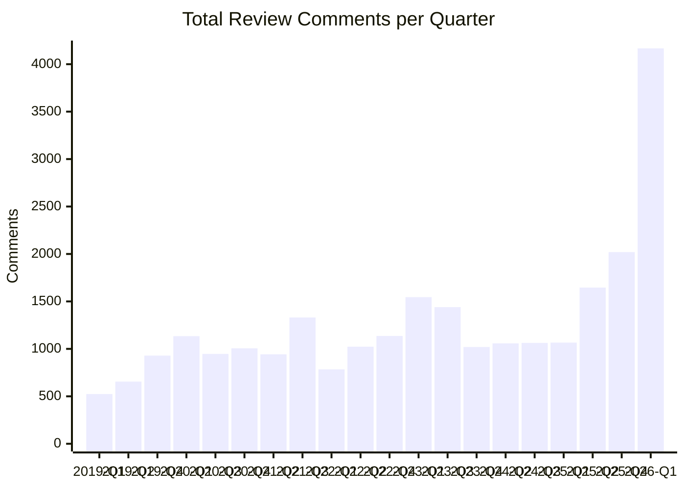
```mermaid
xychart-beta
  title "Total Review Comments per Quarter"
  x-axis ["2019-Q1", "2019-Q2", "2019-Q4", "2020-Q1", "2020-Q3", "2020-Q4", "2021-Q2", "2021-Q3", "2022-Q1", "2022-Q2", "2022-Q4", "2023-Q1", "2023-Q3", "2023-Q4", "2024-Q2", "2024-Q3", "2025-Q1", "2025-Q2", "2025-Q4", "2026-Q1"]
  y-axis "Comments" 0 --> 4167
  bar [524, 655, 929, 1134, 947, 1006, 943, 1331, 784, 1023, 1136, 1545, 1440, 1020, 1058, 1063, 1066, 1646, 2020, 4167]
```

## Per-Category Trends

## T10_CONSISTENCY: Consistency

**Total occurrences**: 281 | **Trajectory**: PERSISTENT →
**Primary reviewers**: Copilot (70), fruch (44), vponomaryov (25), soyacz (22), fgelcer (16)

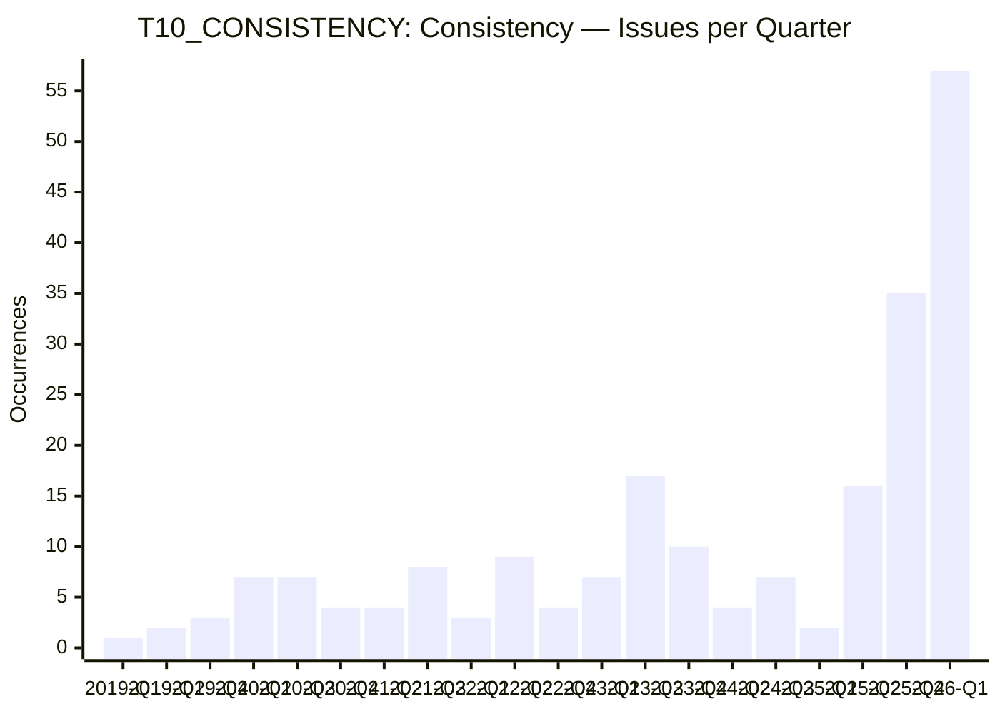
```mermaid
xychart-beta
  title "T10_CONSISTENCY: Consistency — Issues per Quarter"
  x-axis ["2019-Q1", "2019-Q2", "2019-Q4", "2020-Q1", "2020-Q3", "2020-Q4", "2021-Q2", "2021-Q3", "2022-Q1", "2022-Q2", "2022-Q4", "2023-Q1", "2023-Q3", "2023-Q4", "2024-Q2", "2024-Q3", "2025-Q1", "2025-Q2", "2025-Q4", "2026-Q1"]
  y-axis "Occurrences" 0 --> 57
  bar [1, 2, 3, 7, 7, 4, 4, 8, 3, 9, 4, 7, 17, 10, 4, 7, 2, 16, 35, 57]
```

## T11_CONFIG_SYSTEM: Configuration System

**Total occurrences**: 1044 | **Trajectory**: PERSISTENT →
**Primary reviewers**: fruch (392), Copilot (127), vponomaryov (89), roydahan (71), pehala (52)

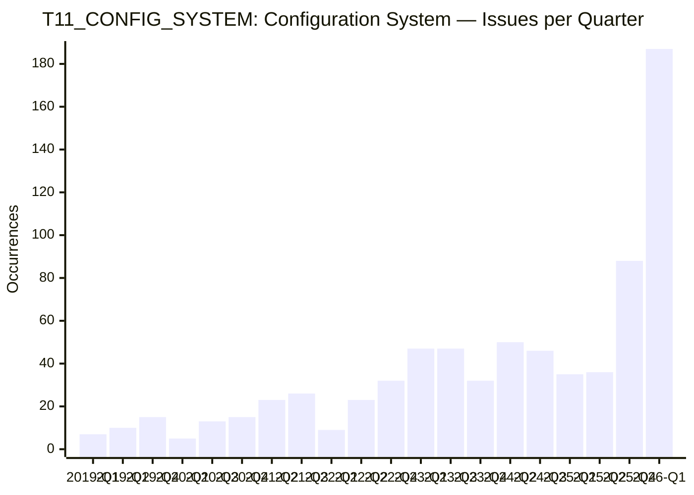
```mermaid
xychart-beta
  title "T11_CONFIG_SYSTEM: Configuration System — Issues per Quarter"
  x-axis ["2019-Q1", "2019-Q2", "2019-Q4", "2020-Q1", "2020-Q3", "2020-Q4", "2021-Q2", "2021-Q3", "2022-Q1", "2022-Q2", "2022-Q4", "2023-Q1", "2023-Q3", "2023-Q4", "2024-Q2", "2024-Q3", "2025-Q1", "2025-Q2", "2025-Q4", "2026-Q1"]
  y-axis "Occurrences" 0 --> 187
  bar [7, 10, 15, 5, 13, 15, 23, 26, 9, 23, 32, 47, 47, 32, 50, 46, 35, 36, 88, 187]
```

## T12_NAMING: Naming

**Total occurrences**: 52 | **Trajectory**: PERSISTENT →
**Primary reviewers**: fruch (10), bentsi (8), roydahan (6), soyacz (6), pehala (5)

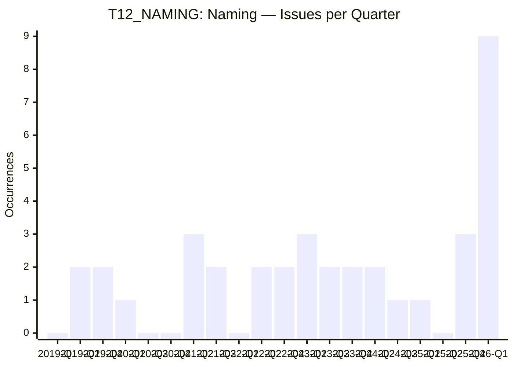
```mermaid
xychart-beta
  title "T12_NAMING: Naming — Issues per Quarter"
  x-axis ["2019-Q1", "2019-Q2", "2019-Q4", "2020-Q1", "2020-Q3", "2020-Q4", "2021-Q2", "2021-Q3", "2022-Q1", "2022-Q2", "2022-Q4", "2023-Q1", "2023-Q3", "2023-Q4", "2024-Q2", "2024-Q3", "2025-Q1", "2025-Q2", "2025-Q4", "2026-Q1"]
  y-axis "Occurrences" 0 --> 9
  bar [0, 2, 2, 1, 0, 0, 3, 2, 0, 2, 2, 3, 2, 2, 2, 1, 1, 0, 3, 9]
```

## T13_LOGIC_CORRECTNESS: Logic Correctness

**Total occurrences**: 140 | **Trajectory**: PERSISTENT →
**Primary reviewers**: soyacz (26), fruch (18), patjed41 (18), vponomaryov (13), pehala (11)

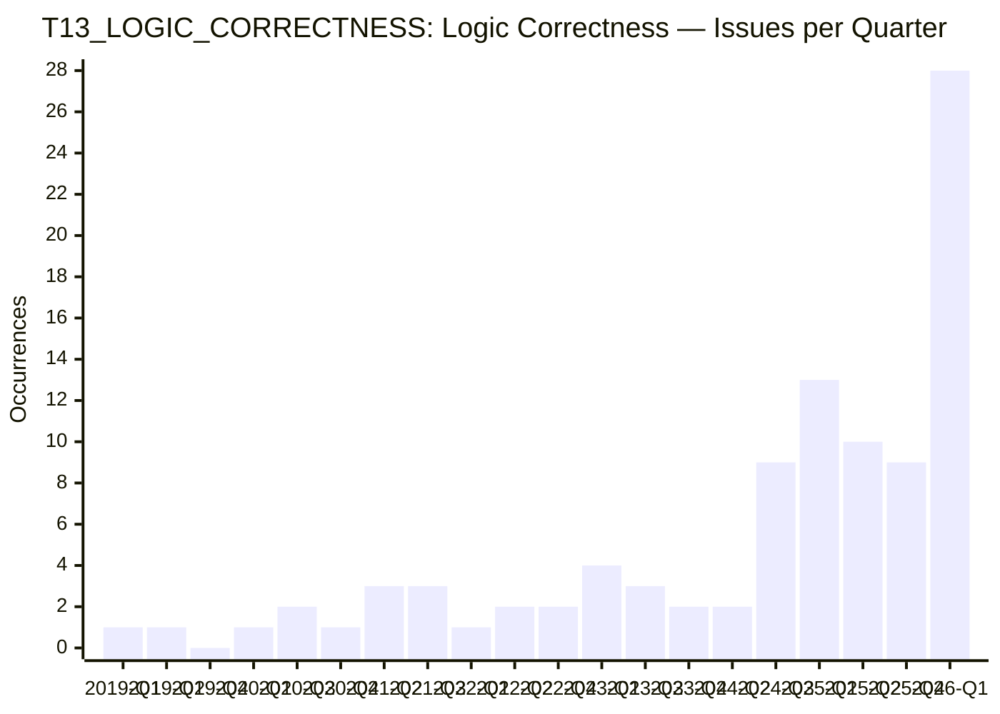
```mermaid
xychart-beta
  title "T13_LOGIC_CORRECTNESS: Logic Correctness — Issues per Quarter"
  x-axis ["2019-Q1", "2019-Q2", "2019-Q4", "2020-Q1", "2020-Q3", "2020-Q4", "2021-Q2", "2021-Q3", "2022-Q1", "2022-Q2", "2022-Q4", "2023-Q1", "2023-Q3", "2023-Q4", "2024-Q2", "2024-Q3", "2025-Q1", "2025-Q2", "2025-Q4", "2026-Q1"]
  y-axis "Occurrences" 0 --> 28
  bar [1, 1, 0, 1, 2, 1, 3, 3, 1, 2, 2, 4, 3, 2, 2, 9, 13, 10, 9, 28]
```

## T14_SECURITY: Security

**Total occurrences**: 406 | **Trajectory**: PERSISTENT →
**Primary reviewers**: fruch (76), Copilot (68), vponomaryov (48), soyacz (43), patjed41 (18)

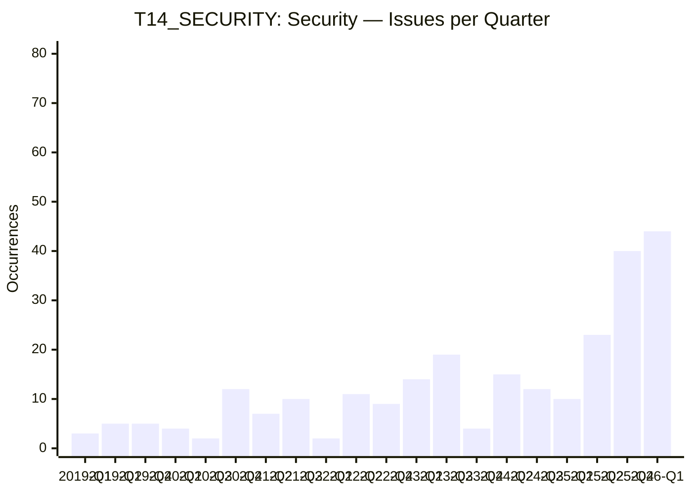
```mermaid
xychart-beta
  title "T14_SECURITY: Security — Issues per Quarter"
  x-axis ["2019-Q1", "2019-Q2", "2019-Q4", "2020-Q1", "2020-Q3", "2020-Q4", "2021-Q2", "2021-Q3", "2022-Q1", "2022-Q2", "2022-Q4", "2023-Q1", "2023-Q3", "2023-Q4", "2024-Q2", "2024-Q3", "2025-Q1", "2025-Q2", "2025-Q4", "2026-Q1"]
  y-axis "Occurrences" 0 --> 81
  bar [3, 5, 5, 4, 2, 12, 7, 10, 2, 11, 9, 14, 19, 4, 15, 12, 10, 23, 40, 44]
```

## T15_SAFETY_RETRY: Safety / Retry

**Total occurrences**: 652 | **Trajectory**: PERSISTENT →
**Primary reviewers**: fruch (135), soyacz (66), vponomaryov (62), fgelcer (60), Copilot (59)

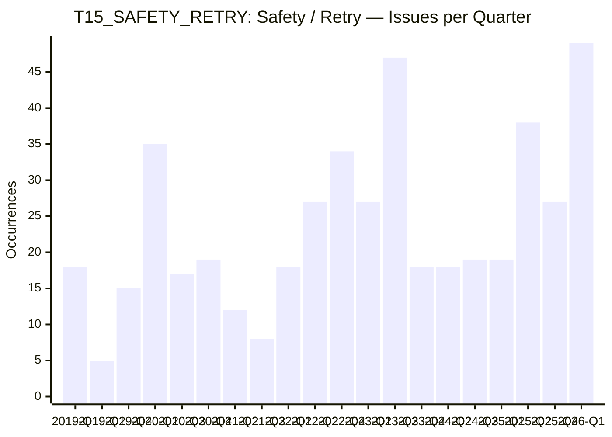
```mermaid
xychart-beta
  title "T15_SAFETY_RETRY: Safety / Retry — Issues per Quarter"
  x-axis ["2019-Q1", "2019-Q2", "2019-Q4", "2020-Q1", "2020-Q3", "2020-Q4", "2021-Q2", "2021-Q3", "2022-Q1", "2022-Q2", "2022-Q4", "2023-Q1", "2023-Q3", "2023-Q4", "2024-Q2", "2024-Q3", "2025-Q1", "2025-Q2", "2025-Q4", "2026-Q1"]
  y-axis "Occurrences" 0 --> 49
  bar [18, 5, 15, 35, 17, 19, 12, 8, 18, 27, 34, 27, 47, 18, 18, 19, 19, 38, 27, 49]
```

## T1_TEST_QUALITY: Test Quality

**Total occurrences**: 338 | **Trajectory**: GROWING ⬆
**Primary reviewers**: fruch (113), Copilot (54), pehala (38), soyacz (27), bentsi (19)

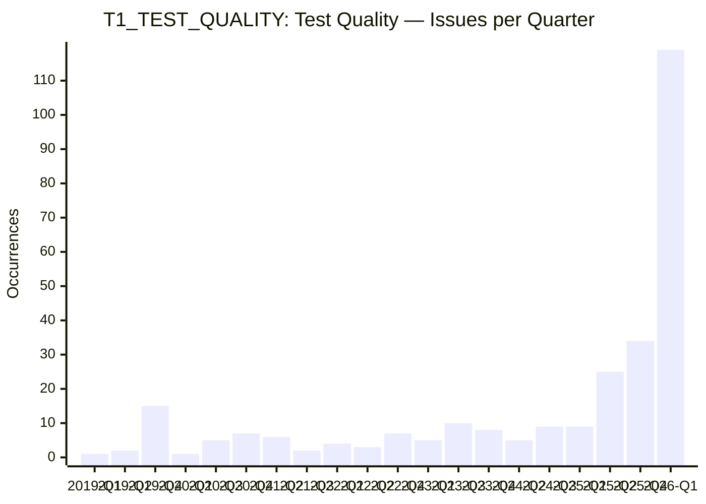
```mermaid
xychart-beta
  title "T1_TEST_QUALITY: Test Quality — Issues per Quarter"
  x-axis ["2019-Q1", "2019-Q2", "2019-Q4", "2020-Q1", "2020-Q3", "2020-Q4", "2021-Q2", "2021-Q3", "2022-Q1", "2022-Q2", "2022-Q4", "2023-Q1", "2023-Q3", "2023-Q4", "2024-Q2", "2024-Q3", "2025-Q1", "2025-Q2", "2025-Q4", "2026-Q1"]
  y-axis "Occurrences" 0 --> 119
  bar [1, 2, 15, 1, 5, 7, 6, 2, 4, 3, 7, 5, 10, 8, 5, 9, 9, 25, 34, 119]
```

## T2_MISSING_DOCUMENTATION: Missing Documentation

**Total occurrences**: 137 | **Trajectory**: PERSISTENT →
**Primary reviewers**: Copilot (31), fruch (27), soyacz (19), pehala (13), roydahan (8)

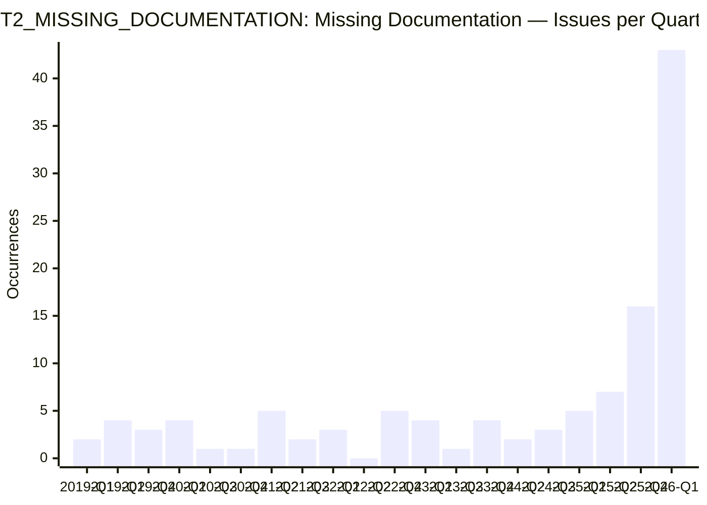
```mermaid
xychart-beta
  title "T2_MISSING_DOCUMENTATION: Missing Documentation — Issues per Quarter"
  x-axis ["2019-Q1", "2019-Q2", "2019-Q4", "2020-Q1", "2020-Q3", "2020-Q4", "2021-Q2", "2021-Q3", "2022-Q1", "2022-Q2", "2022-Q4", "2023-Q1", "2023-Q3", "2023-Q4", "2024-Q2", "2024-Q3", "2025-Q1", "2025-Q2", "2025-Q4", "2026-Q1"]
  y-axis "Occurrences" 0 --> 43
  bar [2, 4, 3, 4, 1, 1, 5, 2, 3, 0, 5, 4, 1, 4, 2, 3, 5, 7, 16, 43]
```

## T3_AI_CODE_QUALITY: AI-Generated Code Quality

**Total occurrences**: 63 | **Trajectory**: GROWING ⬆
**Primary reviewers**: fruch (26), Copilot (15), roydahan (4), soyacz (4), pehala (3)

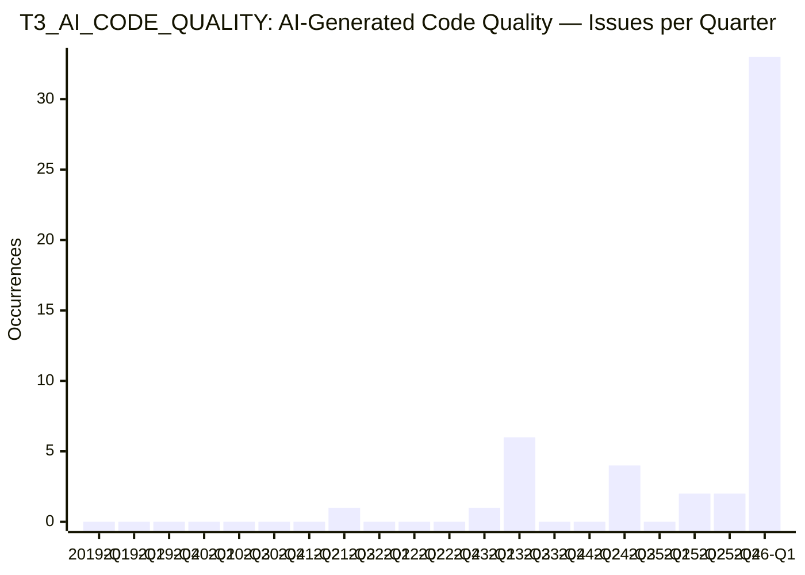
```mermaid
xychart-beta
  title "T3_AI_CODE_QUALITY: AI-Generated Code Quality — Issues per Quarter"
  x-axis ["2019-Q1", "2019-Q2", "2019-Q4", "2020-Q1", "2020-Q3", "2020-Q4", "2021-Q2", "2021-Q3", "2022-Q1", "2022-Q2", "2022-Q4", "2023-Q1", "2023-Q3", "2023-Q4", "2024-Q2", "2024-Q3", "2025-Q1", "2025-Q2", "2025-Q4", "2026-Q1"]
  y-axis "Occurrences" 0 --> 33
  bar [0, 0, 0, 0, 0, 0, 0, 1, 0, 0, 0, 1, 6, 0, 0, 4, 0, 2, 2, 33]
```

## T4_CODE_STRUCTURE: Code Structure

**Total occurrences**: 36 | **Trajectory**: PERSISTENT →
**Primary reviewers**: fruch (12), pehala (10), bentsi (8), fgelcer (3), roydahan (2)

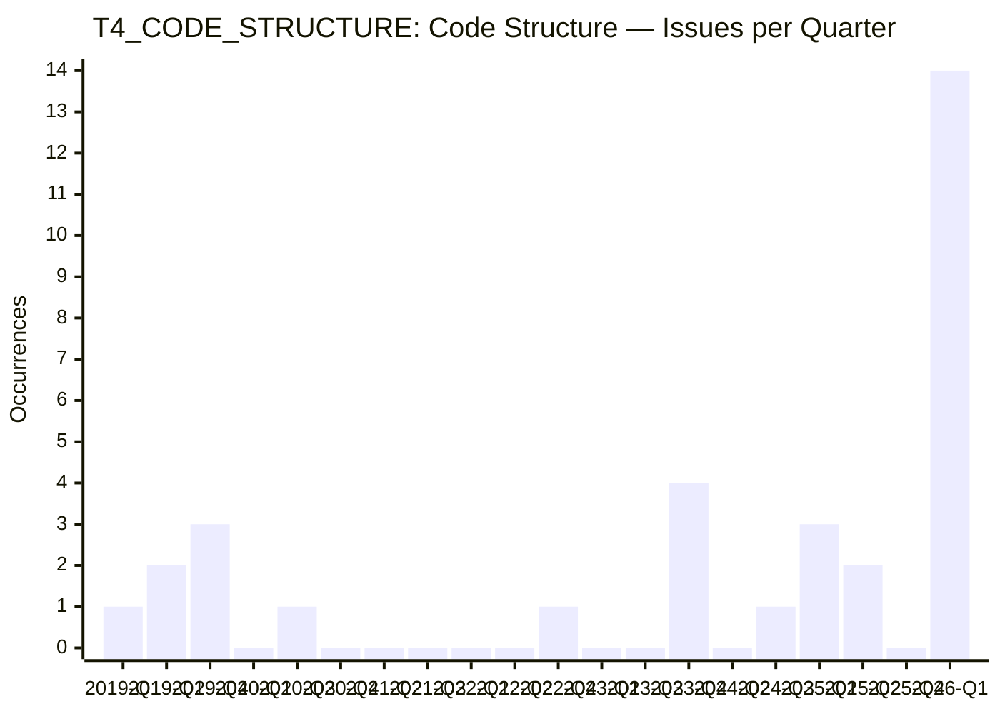
```mermaid
xychart-beta
  title "T4_CODE_STRUCTURE: Code Structure — Issues per Quarter"
  x-axis ["2019-Q1", "2019-Q2", "2019-Q4", "2020-Q1", "2020-Q3", "2020-Q4", "2021-Q2", "2021-Q3", "2022-Q1", "2022-Q2", "2022-Q4", "2023-Q1", "2023-Q3", "2023-Q4", "2024-Q2", "2024-Q3", "2025-Q1", "2025-Q2", "2025-Q4", "2026-Q1"]
  y-axis "Occurrences" 0 --> 14
  bar [1, 2, 3, 0, 1, 0, 0, 0, 0, 0, 1, 0, 0, 4, 0, 1, 3, 2, 0, 14]
```

## T5_SCOPE_HYGIENE: Scope Hygiene

**Total occurrences**: 317 | **Trajectory**: PERSISTENT →
**Primary reviewers**: fruch (82), vponomaryov (54), soyacz (30), pehala (30), Copilot (17)

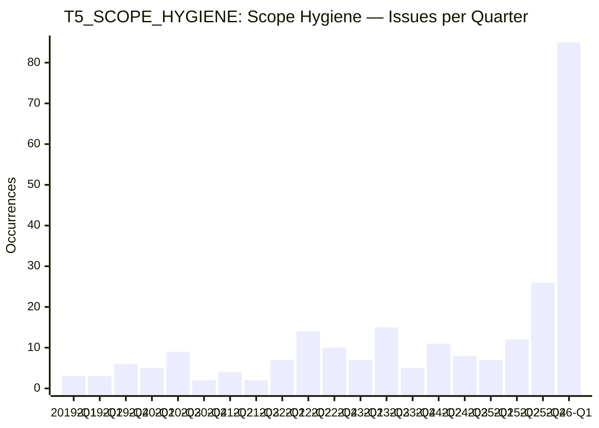
```mermaid
xychart-beta
  title "T5_SCOPE_HYGIENE: Scope Hygiene — Issues per Quarter"
  x-axis ["2019-Q1", "2019-Q2", "2019-Q4", "2020-Q1", "2020-Q3", "2020-Q4", "2021-Q2", "2021-Q3", "2022-Q1", "2022-Q2", "2022-Q4", "2023-Q1", "2023-Q3", "2023-Q4", "2024-Q2", "2024-Q3", "2025-Q1", "2025-Q2", "2025-Q4", "2026-Q1"]
  y-axis "Occurrences" 0 --> 85
  bar [3, 3, 6, 5, 9, 2, 4, 2, 7, 14, 10, 7, 15, 5, 11, 8, 7, 12, 26, 85]
```

## T6_ERROR_HANDLING: Error Handling

**Total occurrences**: 98 | **Trajectory**: INTERMITTENT ↔
**Primary reviewers**: fruch (30), soyacz (12), bentsi (11), vponomaryov (7), juliayakovlev (5)

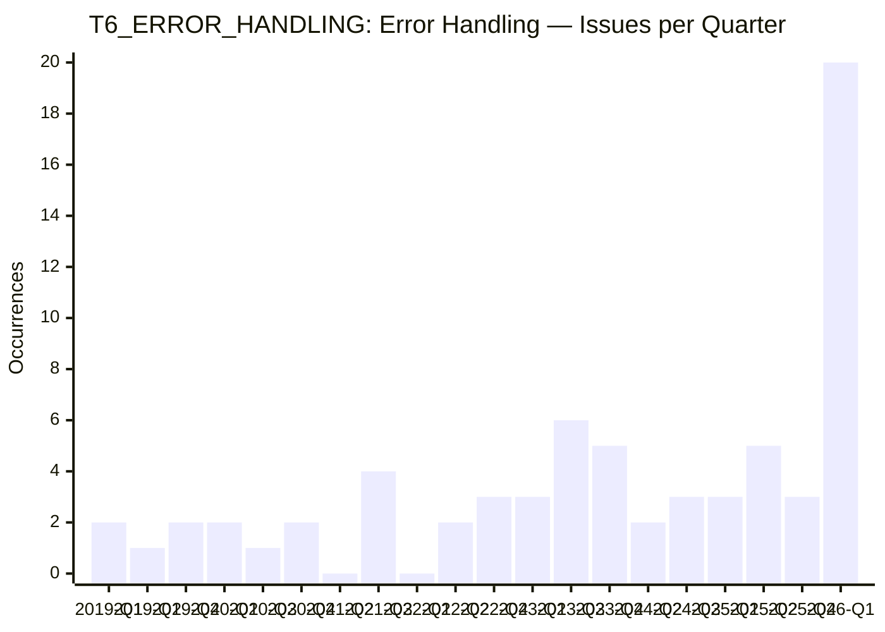
```mermaid
xychart-beta
  title "T6_ERROR_HANDLING: Error Handling — Issues per Quarter"
  x-axis ["2019-Q1", "2019-Q2", "2019-Q4", "2020-Q1", "2020-Q3", "2020-Q4", "2021-Q2", "2021-Q3", "2022-Q1", "2022-Q2", "2022-Q4", "2023-Q1", "2023-Q3", "2023-Q4", "2024-Q2", "2024-Q3", "2025-Q1", "2025-Q2", "2025-Q4", "2026-Q1"]
  y-axis "Occurrences" 0 --> 20
  bar [2, 1, 2, 2, 1, 2, 0, 4, 0, 2, 3, 3, 6, 5, 2, 3, 3, 5, 3, 20]
```

## T7_MISSING_TESTS: Missing Tests

**Total occurrences**: 214 | **Trajectory**: PERSISTENT →
**Primary reviewers**: vponomaryov (43), Copilot (42), fruch (39), soyacz (29), bentsi (15)

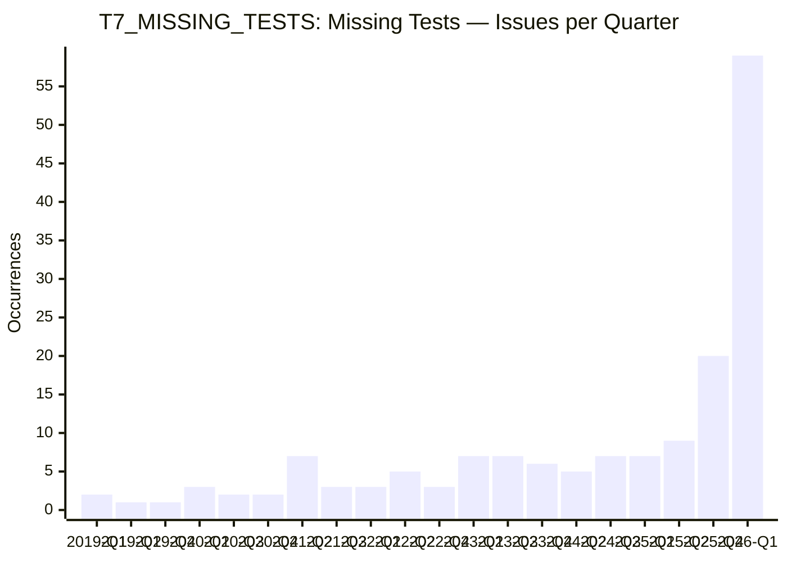
```mermaid
xychart-beta
  title "T7_MISSING_TESTS: Missing Tests — Issues per Quarter"
  x-axis ["2019-Q1", "2019-Q2", "2019-Q4", "2020-Q1", "2020-Q3", "2020-Q4", "2021-Q2", "2021-Q3", "2022-Q1", "2022-Q2", "2022-Q4", "2023-Q1", "2023-Q3", "2023-Q4", "2024-Q2", "2024-Q3", "2025-Q1", "2025-Q2", "2025-Q4", "2026-Q1"]
  y-axis "Occurrences" 0 --> 59
  bar [2, 1, 1, 3, 2, 2, 7, 3, 3, 5, 3, 7, 7, 6, 5, 7, 7, 9, 20, 59]
```

## T8_PLAN_QUALITY: Plan Quality

**Total occurrences**: 36 | **Trajectory**: DECLINING ⬇
**Primary reviewers**: Copilot (18), fruch (6), yarongilor (2), soyacz (2), patjed41 (2)

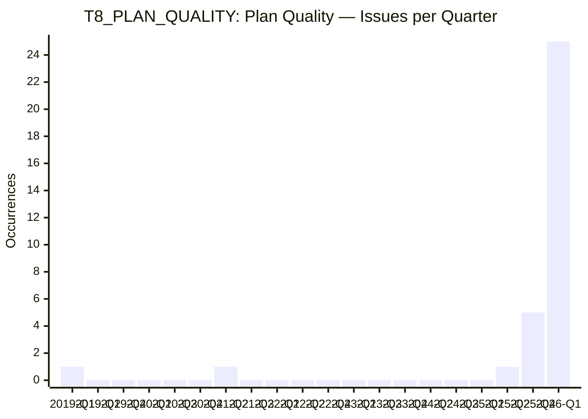
```mermaid
xychart-beta
  title "T8_PLAN_QUALITY: Plan Quality — Issues per Quarter"
  x-axis ["2019-Q1", "2019-Q2", "2019-Q4", "2020-Q1", "2020-Q3", "2020-Q4", "2021-Q2", "2021-Q3", "2022-Q1", "2022-Q2", "2022-Q4", "2023-Q1", "2023-Q3", "2023-Q4", "2024-Q2", "2024-Q3", "2025-Q1", "2025-Q2", "2025-Q4", "2026-Q1"]
  y-axis "Occurrences" 0 --> 25
  bar [1, 0, 0, 0, 0, 0, 1, 0, 0, 0, 0, 0, 0, 0, 0, 0, 0, 1, 5, 25]
```

## T9_UNUSED_DEAD_CODE: Unused / Dead Code

**Total occurrences**: 223 | **Trajectory**: DECLINING ⬇
**Primary reviewers**: fgelcer (16), Copilot (8), enaydanov (7), radoslawcybulski (7), bentsi (6)

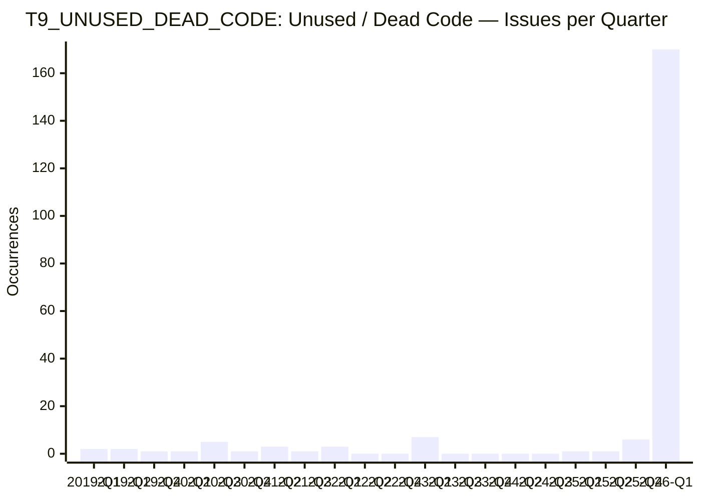
```mermaid
xychart-beta
  title "T9_UNUSED_DEAD_CODE: Unused / Dead Code — Issues per Quarter"
  x-axis ["2019-Q1", "2019-Q2", "2019-Q4", "2020-Q1", "2020-Q3", "2020-Q4", "2021-Q2", "2021-Q3", "2022-Q1", "2022-Q2", "2022-Q4", "2023-Q1", "2023-Q3", "2023-Q4", "2024-Q2", "2024-Q3", "2025-Q1", "2025-Q2", "2025-Q4", "2026-Q1"]
  y-axis "Occurrences" 0 --> 170
  bar [2, 2, 1, 1, 5, 1, 3, 1, 3, 0, 0, 7, 0, 0, 0, 0, 1, 1, 6, 170]
```

## U10_OPINION: Opinion / Assessment

**Total occurrences**: 2443 | **Trajectory**: PERSISTENT →
**Primary reviewers**: fruch (812), pehala (312), roydahan (261), soyacz (222), vponomaryov (179)

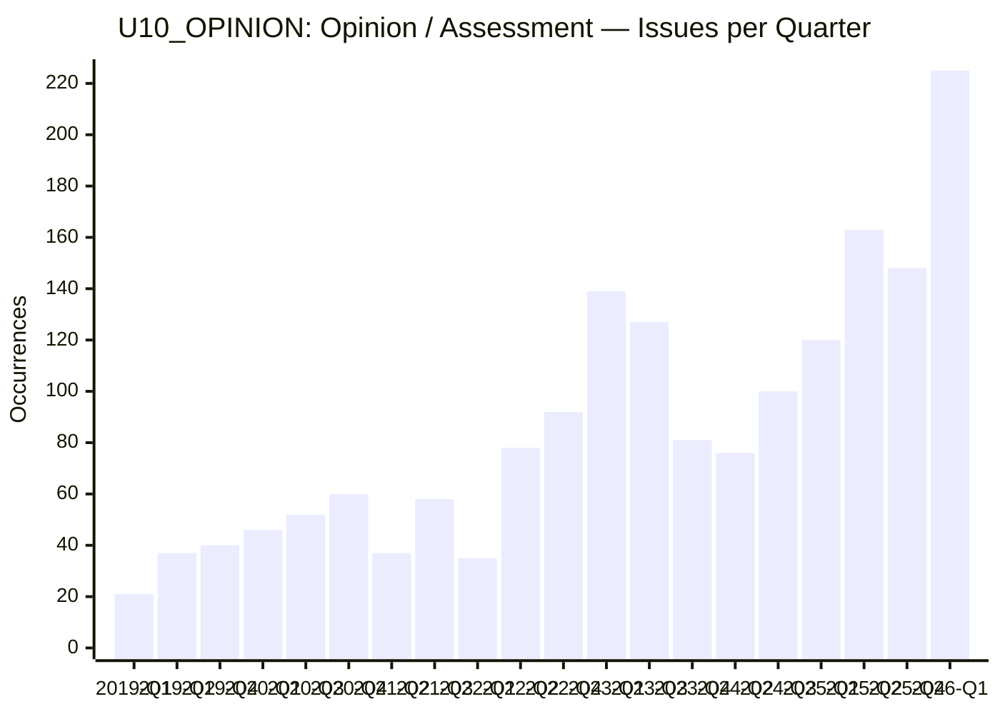
```mermaid
xychart-beta
  title "U10_OPINION: Opinion / Assessment — Issues per Quarter"
  x-axis ["2019-Q1", "2019-Q2", "2019-Q4", "2020-Q1", "2020-Q3", "2020-Q4", "2021-Q2", "2021-Q3", "2022-Q1", "2022-Q2", "2022-Q4", "2023-Q1", "2023-Q3", "2023-Q4", "2024-Q2", "2024-Q3", "2025-Q1", "2025-Q2", "2025-Q4", "2026-Q1"]
  y-axis "Occurrences" 0 --> 225
  bar [21, 37, 40, 46, 52, 60, 37, 58, 35, 78, 92, 139, 127, 81, 76, 100, 120, 163, 148, 225]
```

## U11_DEPENDENCY: Dependency / Version

**Total occurrences**: 688 | **Trajectory**: PERSISTENT →
**Primary reviewers**: fruch (159), Copilot (77), vponomaryov (76), roydahan (50), amoskong (45)

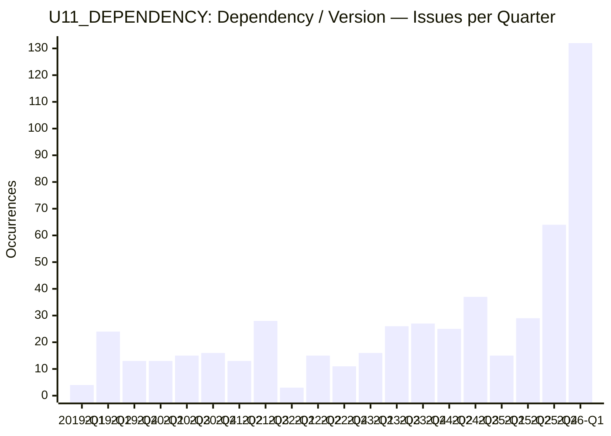
```mermaid
xychart-beta
  title "U11_DEPENDENCY: Dependency / Version — Issues per Quarter"
  x-axis ["2019-Q1", "2019-Q2", "2019-Q4", "2020-Q1", "2020-Q3", "2020-Q4", "2021-Q2", "2021-Q3", "2022-Q1", "2022-Q2", "2022-Q4", "2023-Q1", "2023-Q3", "2023-Q4", "2024-Q2", "2024-Q3", "2025-Q1", "2025-Q2", "2025-Q4", "2026-Q1"]
  y-axis "Occurrences" 0 --> 132
  bar [4, 24, 13, 13, 15, 16, 13, 28, 3, 15, 11, 16, 26, 27, 25, 37, 15, 29, 64, 132]
```

## U1_READABILITY: Readability / Style

**Total occurrences**: 1133 | **Trajectory**: PERSISTENT →
**Primary reviewers**: Copilot (191), vponomaryov (185), fruch (147), soyacz (105), enaydanov (80)

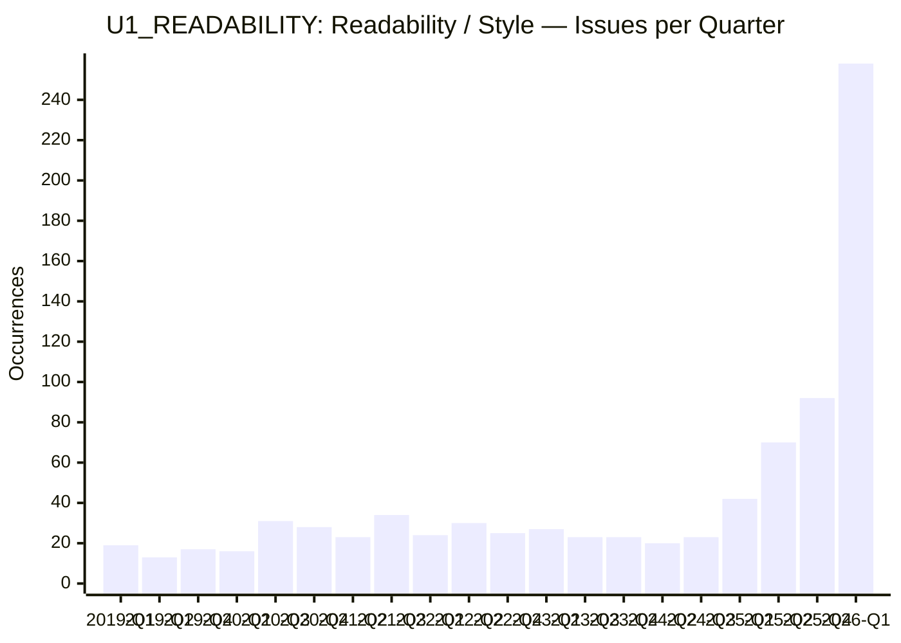
```mermaid
xychart-beta
  title "U1_READABILITY: Readability / Style — Issues per Quarter"
  x-axis ["2019-Q1", "2019-Q2", "2019-Q4", "2020-Q1", "2020-Q3", "2020-Q4", "2021-Q2", "2021-Q3", "2022-Q1", "2022-Q2", "2022-Q4", "2023-Q1", "2023-Q3", "2023-Q4", "2024-Q2", "2024-Q3", "2025-Q1", "2025-Q2", "2025-Q4", "2026-Q1"]
  y-axis "Occurrences" 0 --> 258
  bar [19, 13, 17, 16, 31, 28, 23, 34, 24, 30, 25, 27, 23, 23, 20, 23, 42, 70, 92, 258]
```

## U2_SUGGESTION: Suggestion / Alternative

**Total occurrences**: 1557 | **Trajectory**: PERSISTENT →
**Primary reviewers**: fruch (330), vponomaryov (176), soyacz (148), fgelcer (113), roydahan (106)

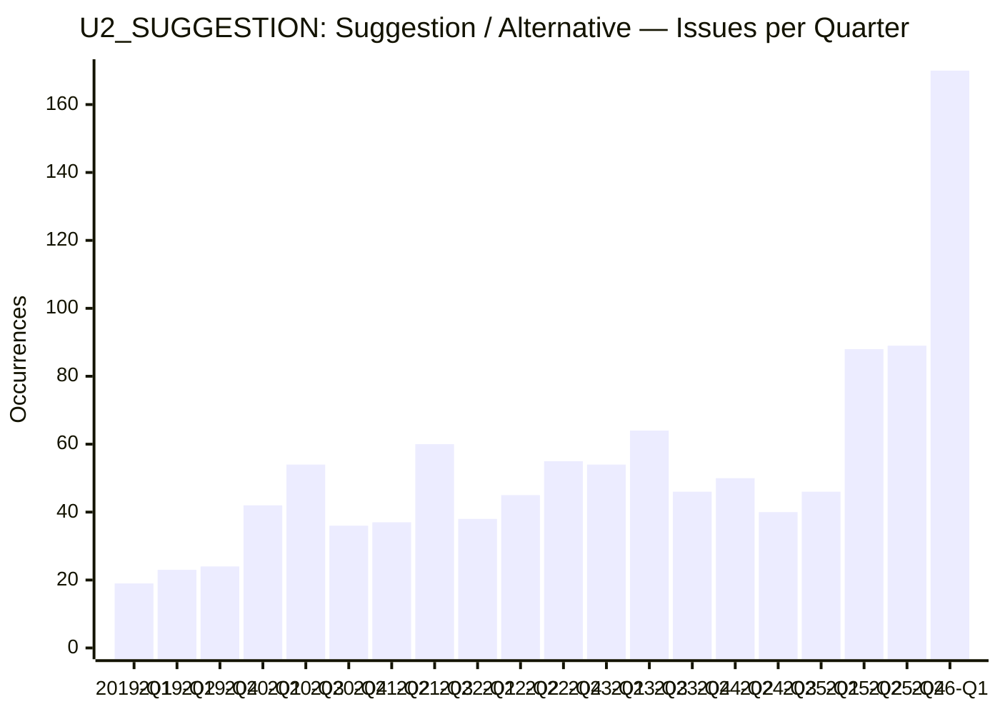
```mermaid
xychart-beta
  title "U2_SUGGESTION: Suggestion / Alternative — Issues per Quarter"
  x-axis ["2019-Q1", "2019-Q2", "2019-Q4", "2020-Q1", "2020-Q3", "2020-Q4", "2021-Q2", "2021-Q3", "2022-Q1", "2022-Q2", "2022-Q4", "2023-Q1", "2023-Q3", "2023-Q4", "2024-Q2", "2024-Q3", "2025-Q1", "2025-Q2", "2025-Q4", "2026-Q1"]
  y-axis "Occurrences" 0 --> 170
  bar [19, 23, 24, 42, 54, 36, 37, 60, 38, 45, 55, 54, 64, 46, 50, 40, 46, 88, 89, 170]
```

## U3_QUESTION: Question / Clarification

**Total occurrences**: 1936 | **Trajectory**: PERSISTENT →
**Primary reviewers**: fruch (471), roydahan (282), vponomaryov (213), bentsi (194), soyacz (166)

```mermaid
xychart-beta
  title "U3_QUESTION: Question / Clarification — Issues per Quarter"
  x-axis ["2019-Q1", "2019-Q2", "2019-Q4", "2020-Q1", "2020-Q3", "2020-Q4", "2021-Q2", "2021-Q3", "2022-Q1", "2022-Q2", "2022-Q4", "2023-Q1", "2023-Q3", "2023-Q4", "2024-Q2", "2024-Q3", "2025-Q1", "2025-Q2", "2025-Q4", "2026-Q1"]
  y-axis "Occurrences" 0 --> 104
  bar [30, 38, 53, 92, 66, 61, 78, 49, 45, 54, 63, 98, 88, 67, 56, 50, 65, 86, 94, 104]
```

## U4_DISCUSSION: Discussion / Context

**Total occurrences**: 2269 | **Trajectory**: PERSISTENT →
**Primary reviewers**: fruch (2583), vponomaryov (1056), fgelcer (882), soyacz (751), aleksbykov (305)

```mermaid
xychart-beta
  title "U4_DISCUSSION: Discussion / Context — Issues per Quarter"
  x-axis ["2019-Q1", "2019-Q2", "2019-Q4", "2020-Q1", "2020-Q3", "2020-Q4", "2021-Q2", "2021-Q3", "2022-Q1", "2022-Q2", "2022-Q4", "2023-Q1", "2023-Q3", "2023-Q4", "2024-Q2", "2024-Q3", "2025-Q1", "2025-Q2", "2025-Q4", "2026-Q1"]
  y-axis "Occurrences" 0 --> 189
  bar [41, 51, 69, 75, 70, 92, 78, 114, 64, 64, 62, 102, 122, 48, 54, 54, 59, 103, 97, 189]
```

## U5_NITPICK: Nitpick

**Total occurrences**: 225 | **Trajectory**: PERSISTENT →
**Primary reviewers**: Copilot (88), pehala (45), fruch (27), soyacz (23), fgelcer (15)

```mermaid
xychart-beta
  title "U5_NITPICK: Nitpick — Issues per Quarter"
  x-axis ["2019-Q1", "2019-Q2", "2019-Q4", "2020-Q1", "2020-Q3", "2020-Q4", "2021-Q2", "2021-Q3", "2022-Q1", "2022-Q2", "2022-Q4", "2023-Q1", "2023-Q3", "2023-Q4", "2024-Q2", "2024-Q3", "2025-Q1", "2025-Q2", "2025-Q4", "2026-Q1"]
  y-axis "Occurrences" 0 --> 43
  bar [0, 0, 1, 0, 3, 4, 0, 3, 3, 1, 4, 3, 1, 5, 3, 5, 6, 43, 38, 32]
```

## U6_PRAISE: Praise

**Total occurrences**: 256 | **Trajectory**: PERSISTENT →
**Primary reviewers**: soyacz (29), aleksbykov (28), amoskong (27), bentsi (23), dkropachev (23)

```mermaid
xychart-beta
  title "U6_PRAISE: Praise — Issues per Quarter"
  x-axis ["2019-Q1", "2019-Q2", "2019-Q4", "2020-Q1", "2020-Q3", "2020-Q4", "2021-Q2", "2021-Q3", "2022-Q1", "2022-Q2", "2022-Q4", "2023-Q1", "2023-Q3", "2023-Q4", "2024-Q2", "2024-Q3", "2025-Q1", "2025-Q2", "2025-Q4", "2026-Q1"]
  y-axis "Occurrences" 0 --> 19
  bar [6, 5, 12, 13, 15, 12, 11, 19, 16, 9, 6, 7, 12, 6, 6, 2, 10, 6, 7, 14]
```

## U7_EXPLANATION: Explanation / Context

**Total occurrences**: 334 | **Trajectory**: PERSISTENT →
**Primary reviewers**: fruch (93), roydahan (32), soyacz (25), fgelcer (19), vponomaryov (19)

```mermaid
xychart-beta
  title "U7_EXPLANATION: Explanation / Context — Issues per Quarter"
  x-axis ["2019-Q1", "2019-Q2", "2019-Q4", "2020-Q1", "2020-Q3", "2020-Q4", "2021-Q2", "2021-Q3", "2022-Q1", "2022-Q2", "2022-Q4", "2023-Q1", "2023-Q3", "2023-Q4", "2024-Q2", "2024-Q3", "2025-Q1", "2025-Q2", "2025-Q4", "2026-Q1"]
  y-axis "Occurrences" 0 --> 44
  bar [6, 4, 6, 11, 9, 11, 8, 15, 4, 8, 9, 18, 10, 9, 9, 9, 6, 22, 18, 44]
```

## U8_DIRECTIVE: Directive / Instruction

**Total occurrences**: 6098 | **Trajectory**: PERSISTENT →
**Primary reviewers**: fruch (1393), juliayakovlev (622), roydahan (554), aleksbykov (549), bentsi (502)

```mermaid
xychart-beta
  title "U8_DIRECTIVE: Directive / Instruction — Issues per Quarter"
  x-axis ["2019-Q1", "2019-Q2", "2019-Q4", "2020-Q1", "2020-Q3", "2020-Q4", "2021-Q2", "2021-Q3", "2022-Q1", "2022-Q2", "2022-Q4", "2023-Q1", "2023-Q3", "2023-Q4", "2024-Q2", "2024-Q3", "2025-Q1", "2025-Q2", "2025-Q4", "2026-Q1"]
  y-axis "Occurrences" 0 --> 841
  bar [127, 149, 205, 261, 152, 217, 173, 286, 143, 152, 196, 235, 185, 170, 168, 135, 152, 207, 241, 841]
```

## U9_PROCESS: Process / Workflow

**Total occurrences**: 3189 | **Trajectory**: PERSISTENT →
**Primary reviewers**: fruch (786), Copilot (357), vponomaryov (337), soyacz (285), roydahan (230)

```mermaid
xychart-beta
  title "U9_PROCESS: Process / Workflow — Issues per Quarter"
  x-axis ["2019-Q1", "2019-Q2", "2019-Q4", "2020-Q1", "2020-Q3", "2020-Q4", "2021-Q2", "2021-Q3", "2022-Q1", "2022-Q2", "2022-Q4", "2023-Q1", "2023-Q3", "2023-Q4", "2024-Q2", "2024-Q3", "2025-Q1", "2025-Q2", "2025-Q4", "2026-Q1"]
  y-axis "Occurrences" 0 --> 516
  bar [17, 54, 68, 69, 45, 61, 67, 83, 70, 94, 78, 138, 112, 88, 117, 131, 92, 155, 266, 516]
```

## AI-Authored vs Human-Authored PRs

| Metric | Human PRs | AI PRs |
|--------|-----------|--------|
| PR count | 11078 | 234 |
| Total comments | 34027 | 1907 |
| T10_CONSISTENCY (Consistency) rate | 0.8% | 2.1% |
| T11_CONFIG_SYSTEM (Configuration System) rate | 3.2% | 8.0% |
| T12_NAMING (Naming) rate | 0.1% | 0.3% |
| T13_LOGIC_CORRECTNESS (Logic Correctness) rate | 0.4% | 1.2% |
| T14_SECURITY (Security) rate | 1.3% | 1.6% |
| T15_SAFETY_RETRY (Safety / Retry) rate | 2.0% | 1.6% |
| T1_TEST_QUALITY (Test Quality) rate | 0.9% | 5.1% |
| T2_MISSING_DOCUMENTATION (Missing Documentation) rate | 0.4% | 1.7% |
| T3_AI_CODE_QUALITY (AI-Generated Code Quality) rate | 0.2% | 1.8% |
| T4_CODE_STRUCTURE (Code Structure) rate | 0.1% | 0.6% |
| T5_SCOPE_HYGIENE (Scope Hygiene) rate | 0.9% | 3.5% |
| T6_ERROR_HANDLING (Error Handling) rate | 0.3% | 0.9% |
| T7_MISSING_TESTS (Missing Tests) rate | 0.9% | 2.7% |
| T8_PLAN_QUALITY (Plan Quality) rate | 0.0% | 1.5% |
| T9_UNUSED_DEAD_CODE (Unused / Dead Code) rate | 0.2% | 8.4% |
| U10_OPINION (Opinion / Assessment) rate | 7.5% | 6.7% |
| U11_DEPENDENCY (Dependency / Version) rate | 2.1% | 5.7% |
| U1_READABILITY (Readability / Style) rate | 3.1% | 11.6% |
| U2_SUGGESTION (Suggestion / Alternative) rate | 4.8% | 6.3% |
| U3_QUESTION (Question / Clarification) rate | 5.8% | 3.1% |
| U4_DISCUSSION (Discussion / Context) rate | 21.7% | 12.5% |
| U5_NITPICK (Nitpick) rate | 0.8% | 1.4% |
| U6_PRAISE (Praise) rate | 0.9% | 0.3% |
| U7_EXPLANATION (Explanation / Context) rate | 1.0% | 1.6% |
| U8_DIRECTIVE (Directive / Instruction) rate | 17.0% | 37.8% |
| U9_PROCESS (Process / Workflow) rate | 9.9% | 20.5% |

## Reviewer Specialization

| Reviewer | Top Category | 2nd Category | 3rd Category | Total Comments |
|----------|-------------|--------------|--------------|----------------|
| fruch | U4_DISCUSSION (2583) | U8_DIRECTIVE (1393) | U10_OPINION (812) | 10296 |
| vponomaryov | U4_DISCUSSION (1056) | U9_PROCESS (337) | U8_DIRECTIVE (231) | 4031 |
| soyacz | U4_DISCUSSION (751) | U9_PROCESS (285) | U8_DIRECTIVE (248) | 3458 |
| roydahan | U8_DIRECTIVE (554) | U3_QUESTION (282) | U10_OPINION (261) | 2955 |
| fgelcer | U4_DISCUSSION (882) | U8_DIRECTIVE (226) | U9_PROCESS (205) | 2955 |
| bentsi | U8_DIRECTIVE (502) | U3_QUESTION (194) | U9_PROCESS (105) | 2172 |
| Copilot | U9_PROCESS (357) | U8_DIRECTIVE (248) | U1_READABILITY (191) | 1908 |
| aleksbykov | U8_DIRECTIVE (549) | U4_DISCUSSION (305) | U9_PROCESS (99) | 1849 |
| pehala | U10_OPINION (312) | U8_DIRECTIVE (157) | U3_QUESTION (140) | 1744 |
| juliayakovlev | U8_DIRECTIVE (622) | U4_DISCUSSION (246) | U9_PROCESS (77) | 1720 |

## Category Deep Dives

### T10_CONSISTENCY: Consistency

**Pilot count**: 8 | **7-year total**: 281 | **Trajectory**: PERSISTENT →
**Emerged**: 2019-Q1 | **Peak**: 2026-Q1 (57 occurrences)
**Primary enforcers**: pehala, fruch, soyacz

**What reviewers say**:

> "I would unify the handling...for consistency"
> "Cannot we use nodeallocator to do this more easily?"
> "align all of those into the same format"

### T11_CONFIG_SYSTEM: Configuration System

**Pilot count**: 8 | **7-year total**: 1044 | **Trajectory**: PERSISTENT →
**Emerged**: 2019-Q1 | **Peak**: 2026-Q1 (187 occurrences)
**Primary enforcers**: fruch, pehala, soyacz

**What reviewers say**:

> "we shouldn't have empty help values"
> "This should be done as part of validation in configuration"
> "shouldnt this be configurable?"

### T12_NAMING: Naming

**Pilot count**: 5 | **7-year total**: 52 | **Trajectory**: PERSISTENT →
**Emerged**: 2019-Q2 | **Peak**: 2026-Q1 (9 occurrences)
**Primary enforcers**: fruch, pehala

**What reviewers say**:

> "shouldn't name it ami_id, we need better name if we ever want similar test in other backends"
> "overabundance of protected function/attributes... making this file hard to read"
> "no need to make this protected"

### T13_LOGIC_CORRECTNESS: Logic Correctness

**Pilot count**: 15 | **7-year total**: 140 | **Trajectory**: PERSISTENT →
**Emerged**: 2019-Q1 | **Peak**: 2026-Q1 (28 occurrences)
**Primary enforcers**: pehala, fruch, soyacz

**What reviewers say**:

> "this code is wrong, seeds need to be a comma separated list of addresses, not an actual list"
> "Zero-token nodes are supported only with consistent topology changes...You should enforce this somehow"
> "If we fail to count them, shouldn't we throw an exception? By returning zero the test might pass"

### T14_SECURITY: Security

**Pilot count**: 4 | **7-year total**: 406 | **Trajectory**: PERSISTENT →
**Emerged**: 2019-Q1 | **Peak**: 2025-Q3 (81 occurrences)
**Primary enforcers**: fruch, pehala

### T15_SAFETY_RETRY: Safety / Retry

**Pilot count**: 2 | **7-year total**: 652 | **Trajectory**: PERSISTENT →
**Emerged**: 2019-Q1 | **Peak**: 2026-Q1 (49 occurrences)
**Primary enforcers**: fruch, pehala, soyacz

### T1_TEST_QUALITY: Test Quality

**Pilot count**: 38 | **7-year total**: 338 | **Trajectory**: GROWING ⬆
**Emerged**: 2019-Q1 | **Peak**: 2026-Q1 (119 occurrences)
**Primary enforcers**: pehala, fruch

**What reviewers say**:

> "Dont use classes, if you need tests grouping uses module + separate files"
> "This should be a fixture, instead of having to call it in every test"
> "can be made into one test with parametrization probably"

### T2_MISSING_DOCUMENTATION: Missing Documentation

**Pilot count**: 19 | **7-year total**: 137 | **Trajectory**: PERSISTENT →
**Emerged**: 2019-Q1 | **Peak**: 2026-Q1 (43 occurrences)
**Primary enforcers**: fruch, pehala, soyacz

**What reviewers say**:

> "write the descriptions for those, we shouldn't have empty help values"
> "Please add documentation for this nemesis"
> "why max is 10? what makes it reasonable? please add clear comment about the why"

### T3_AI_CODE_QUALITY: AI-Generated Code Quality

**Pilot count**: 28 | **7-year total**: 63 | **Trajectory**: GROWING ⬆
**Emerged**: 2021-Q3 | **Peak**: 2026-Q1 (33 occurrences)
**Primary enforcers**: fruch, pehala, soyacz

**What reviewers say**:

> "@copilot this is wrong solution"
> "As always with claude generated PRs I think the tests are low quality and should be improved upon"
> "need to bring this back"

### T4_CODE_STRUCTURE: Code Structure

**Pilot count**: 16 | **7-year total**: 36 | **Trajectory**: PERSISTENT →
**Emerged**: 2019-Q1 | **Peak**: 2026-Q1 (14 occurrences)
**Primary enforcers**: pehala, fruch

**What reviewers say**:

> "nit: no need for this to be inner method"
> "better to centralize the defaults somewhere so it is easier to change them"
> "don't initialize an argument with a mutable list"

### T5_SCOPE_HYGIENE: Scope Hygiene

**Pilot count**: 12 | **7-year total**: 317 | **Trajectory**: PERSISTENT →
**Emerged**: 2019-Q1 | **Peak**: 2026-Q1 (85 occurrences)
**Primary enforcers**: pehala, fruch

**What reviewers say**:

> "This far out of scope for this PR, needs to be removed and put into its own PR"
> "how taking this comment out, is related to this PR?"
> "raise a task/subtask in jira"

### T6_ERROR_HANDLING: Error Handling

**Pilot count**: 9 | **7-year total**: 98 | **Trajectory**: INTERMITTENT ↔
**Emerged**: 2019-Q1 | **Peak**: 2026-Q1 (20 occurrences)
**Primary enforcers**: soyacz, pehala, fruch

**What reviewers say**:

> "if something escaped check_node_health we should raise error event, so it would be visible in Argus"
> "if it is invalid input, you should throw exception"
> "does not use try/finally around the yield, so event_stop will not be called"

### T7_MISSING_TESTS: Missing Tests

**Pilot count**: 8 | **7-year total**: 214 | **Trajectory**: PERSISTENT →
**Emerged**: 2019-Q1 | **Peak**: 2026-Q1 (59 occurrences)
**Primary enforcers**: fruch, pehala

**What reviewers say**:

> "there isn't a unit test asserting the parsing behavior"
> "Do you think we could unit test this as well?"
> "This test is great for onetime verification, but running it constantly doesn't give us assurances"

### T8_PLAN_QUALITY: Plan Quality

**Pilot count**: 18 | **7-year total**: 36 | **Trajectory**: DECLINING ⬇
**Emerged**: 2019-Q1 | **Peak**: 2026-Q1 (25 occurrences)
**Primary enforcers**: fruch, pehala, soyacz

**What reviewers say**:

> "remove implementation details from plan, it's in the way and not needed"
> "don't include test code of unittest in the plan"
> "minimize the testing to test ideas, don't write the python code for testing"

### T9_UNUSED_DEAD_CODE: Unused / Dead Code

**Pilot count**: 20 | **7-year total**: 223 | **Trajectory**: DECLINING ⬇
**Emerged**: 2019-Q1 | **Peak**: 2026-Q1 (170 occurrences)
**Primary enforcers**: N/A

**What reviewers say**:

> "Unused import of 'KernelPanicEvent' is not used"
> "This comment appears to contain commented-out code"
> "Suspicious unused loop iteration variable"

### U10_OPINION: Opinion / Assessment

**Pilot count**: 0 | **7-year total**: 2443 | **Trajectory**: PERSISTENT →
**Emerged**: 2019-Q1 | **Peak**: 2026-Q1 (225 occurrences)
**Primary enforcers**: N/A

### U11_DEPENDENCY: Dependency / Version

**Pilot count**: 0 | **7-year total**: 688 | **Trajectory**: PERSISTENT →
**Emerged**: 2019-Q1 | **Peak**: 2026-Q1 (132 occurrences)
**Primary enforcers**: N/A

### U1_READABILITY: Readability / Style

**Pilot count**: 0 | **7-year total**: 1133 | **Trajectory**: PERSISTENT →
**Emerged**: 2019-Q1 | **Peak**: 2026-Q1 (258 occurrences)
**Primary enforcers**: N/A

### U2_SUGGESTION: Suggestion / Alternative

**Pilot count**: 0 | **7-year total**: 1557 | **Trajectory**: PERSISTENT →
**Emerged**: 2019-Q1 | **Peak**: 2026-Q1 (170 occurrences)
**Primary enforcers**: N/A

### U3_QUESTION: Question / Clarification

**Pilot count**: 0 | **7-year total**: 1936 | **Trajectory**: PERSISTENT →
**Emerged**: 2019-Q1 | **Peak**: 2026-Q1 (104 occurrences)
**Primary enforcers**: N/A

### U4_DISCUSSION: Discussion / Context

**Pilot count**: 0 | **7-year total**: 2269 | **Trajectory**: PERSISTENT →
**Emerged**: 2019-Q1 | **Peak**: 2026-Q1 (189 occurrences)
**Primary enforcers**: N/A

### U5_NITPICK: Nitpick

**Pilot count**: 0 | **7-year total**: 225 | **Trajectory**: PERSISTENT →
**Emerged**: 2019-Q3 | **Peak**: 2025-Q2 (43 occurrences)
**Primary enforcers**: N/A

### U6_PRAISE: Praise

**Pilot count**: 0 | **7-year total**: 256 | **Trajectory**: PERSISTENT →
**Emerged**: 2019-Q1 | **Peak**: 2021-Q3 (19 occurrences)
**Primary enforcers**: N/A

### U7_EXPLANATION: Explanation / Context

**Pilot count**: 0 | **7-year total**: 334 | **Trajectory**: PERSISTENT →
**Emerged**: 2019-Q1 | **Peak**: 2026-Q1 (44 occurrences)
**Primary enforcers**: N/A

### U8_DIRECTIVE: Directive / Instruction

**Pilot count**: 0 | **7-year total**: 6098 | **Trajectory**: PERSISTENT →
**Emerged**: 2019-Q1 | **Peak**: 2026-Q1 (841 occurrences)
**Primary enforcers**: N/A

### U9_PROCESS: Process / Workflow

**Pilot count**: 0 | **7-year total**: 3189 | **Trajectory**: PERSISTENT →
**Emerged**: 2019-Q1 | **Peak**: 2026-Q1 (516 occurrences)
**Primary enforcers**: N/A

## Recommendations for Skill Design

### Skills to Create (data-backed)

#### 1. `skills/code-review/` — Priority: HIGH
Checklist ordered by 7-year occurrence count:

1. [ ] Test Quality (T1): 338 occurrences — use pytest functions, fixtures, parametrize
2. [ ] Scope Hygiene (T5): 317 occurrences — changes must be scoped to the PR
3. [ ] Missing Tests (T7): 214 occurrences — unit tests for new parsing / config / utility logic
4. [ ] Logic Correctness (T13): 140 occurrences — verify data structures, formats, return values
5. [ ] Missing Documentation (T2): 137 occurrences — config help, docstrings, 'why' comments
6. [ ] Error Handling (T6): 98 occurrences — try/except/finally, raise events, validate inputs
7. [ ] Code Structure (T4): 36 occurrences — avoid inner functions, mutable defaults, centralize

#### 2. `skills/ai-code-audit/` — Priority: HIGH (T3 count: 63)
Justified: T3 occurrences (63) exceed threshold of 50.

#### 3. `skills/plan-review/` — Priority: HIGH (T8 count: 36)
Justified: T8 occurrences (36) exceed threshold of 30.

### Automated Checks Already in Place

- T9 (Unused/Dead Code): automated by CodeQL and github-code-quality bot
- Formatting: handled by pre-commit (ruff, autopep8)
- Commit message format: handled by commitlint
